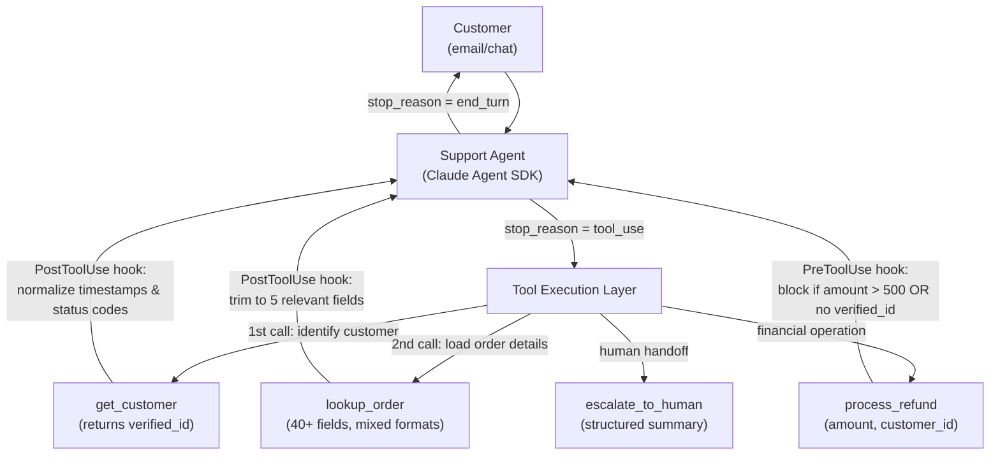

# Scenario 1: Customer Support Resolution Agent

> **Primary domains:** 1 (Agentic Architecture & Orchestration), 2 (Tool Design & MCP Integration), 5 (Context Management & Reliability)
> **Task statements in play:** 1.1, 1.4, 1.5, 1.6, 2.1, 2.2, 2.3, 5.1, 5.2
> **Exam weight:** This scenario anchors questions from 3 of the 5 domains. It appears in every domain-1, domain-2, and domain-5 study guide as a primary example.

---

## Table of Contents

1. [The Scenario](#1-the-scenario)
2. [System Architecture](#2-system-architecture)
3. [Role of Each Domain in This Scenario](#3-role-of-each-domain-in-this-scenario)
4. [What This Scenario Tests From You](#4-what-this-scenario-tests-from-you)
5. [Domain Task-Statement Walkthrough](#5-domain-task-statement-walkthrough)
6. [Scenario-Specific Traps](#6-scenario-specific-traps)
7. [Practice Question Bank](#7-practice-question-bank)
8. [Answer Key](#8-answer-key)
9. [Quick-Recall Cheat Sheet](#9-quick-recall-cheat-sheet)

---


## 1. The Scenario

You are building a customer support resolution agent for a SaaS company using the **Claude Agent SDK**. The agent handles high-ambiguity inbound requests: product returns, billing disputes, account access issues, and subscription changes.

**The agent has access to exactly four MCP tools:**


| Tool                | Purpose                                            | Key constraint                                                                        |
| ------------------- | -------------------------------------------------- | ------------------------------------------------------------------------------------- |
| `get_customer`      | Look up customer record by email or phone          | Must be called first — returns `verified_id` used by downstream tools                 |
| `lookup_order`      | Retrieve order details, status, and timeline       | Returns 40+ fields in mixed formats (Unix timestamps, ISO 8601, numeric status codes) |
| `process_refund`    | Issue a refund to the original payment method      | Blocked if `verified_id` not present; blocked if `amount > 500` by policy             |
| `escalate_to_human` | Hand off to a live agent with a structured summary | Required when policy has no answer, or customer explicitly requests it                |


**Business policies (non-negotiable):**

- Refunds above **$500** require human approval — no exceptions.
- Identity **must** be verified via `get_customer` before any financial operation fires.
- Target: **80%+ first-contact resolution** — escalation is a last resort, not a first response.
- When escalating, the agent must pass a structured handoff including: `customer_id`, `issue_summary`, `root_cause`, `refund_amount`, `recommended_action`.

**The real design challenge:** This system must be deterministic about safety rules ($500 cap, identity gate) in a production environment where a 1–2% failure rate from prompt-based instructions means real financial exposure. The exam tests whether you know when "the model will probably follow the rule" is not good enough.

---


## 2. System Architecture




**Key architectural facts to memorize:**

- The agent is a **single agent** — no coordinator/subagent hierarchy (that is Scenario 3).
- Hooks are the enforcement layer, not the system prompt.
- `get_customer` → `lookup_order` → `process_refund` is the correct sequence, enforced programmatically.

---


## 3. Role of Each Domain in This Scenario


| Domain                               | Role                                                                                                                              | Tested?                  |
| ------------------------------------ | --------------------------------------------------------------------------------------------------------------------------------- | ------------------------ |
| **Domain 1 — Agentic Architecture**  | **Primary.** Controls the loop logic (`stop_reason`), prerequisite gates, hook patterns, and multi-concern task decomposition     | Yes — 1.1, 1.4, 1.5, 1.6 |
| **Domain 2 — Tool Design & MCP**     | **Primary.** Defines the 4-tool contract: clear descriptions, structured error responses, tool scoping, `tool_choice`             | Yes — 2.1, 2.2, 2.3      |
| **Domain 3 — Claude Code Config**    | **Not tested.** This is an Agent SDK application, not a Claude Code workflow                                                      | No                       |
| **Domain 4 — Prompt Engineering**    | **Minor crossover.** Few-shot examples improve escalation-criteria precision; explicit criteria reduce false-positive escalations | Lightly — woven into 5.2 |
| **Domain 5 — Context & Reliability** | **Primary.** Keeps transactional facts alive across long conversations; decides when handoff is warranted                         | Yes — 5.1, 5.2           |


**The short version:** Domains 1, 2, and 5 each own a distinct layer of this system. Domain 1 = control flow and enforcement. Domain 2 = tool contracts and error handling. Domain 5 = information fidelity and escalation judgment. Domain 3 and 4 are not the primary lens here.

---

## 4. What This Scenario Tests From You

This scenario tests one meta-skill above all else: **knowing when "the model will probably follow the rule" is not good enough**. Every question anchored to Scenario 1 is, at its core, asking whether you would use a probabilistic mechanism (system prompt, few-shot, wording) or a deterministic one (hook, prerequisite gate, structured error field) for a given compliance requirement.

### Knowledge you must have cold

| Must know | Detail |
|---|---|
| `stop_reason` values | `"tool_use"` = continue loop; `"end_turn"` = terminate. Never use text content as the signal. |
| Hook types and timing | `PreToolUse` = fires before tool executes (block/modify outgoing calls); `PostToolUse` = fires after tool returns (normalize/trim results) |
| The $500 / identity-gate rules | These are the canonical policy examples — always enforced by hooks, never by system prompt |
| Structured error fields | `errorCategory`, `isRetryable`, human-readable `description` — minimum three fields for any tool error |
| Escalation triggers | Explicit customer request = immediate escalation, no exceptions; policy gap = escalate; sentiment/confidence = never escalate |
| `tool_choice: "any"` | Forces the model to call a tool rather than returning a conversational response |
| CASE_FACTS pattern | Verbatim transactional facts (amounts, order IDs, dates) stored outside summarized history at prompt beginning |

### Judgment calls the exam will ask you to make

| Exam question type | The judgment you must apply |
|---|---|
| "The agent sometimes processes refunds without verifying identity — fix it" | Choose a `PreToolUse` hook (deterministic), not a system-prompt instruction (probabilistic) |
| "The agent stops after printing 'I'll resolve this now' — fix it" | Termination logic checks text content instead of `stop_reason` — remove the text check |
| "Timestamps from `lookup_order` are inconsistent — fix it" | `PostToolUse` hook normalizes before the model sees the result |
| "The agent ignores a customer who said 'I want a human' — fix it" | Immediate escalation, no "let me try one more thing" |
| "Context window fills with 40-field tool responses — fix it" | `PostToolUse` hook trims to only the relevant fields |
| "Tool returns empty on timeout and agent says 'no orders found' — fix it" | Structured error with `isRetryable` — not an empty result |

### Wrong-answer patterns to immediately recognize and reject

- Any answer that puts enforcement logic in the **system prompt** when the question says "guarantee," "always," or "never"
- Any answer that **escalates based on sentiment, frustration, or Claude's expressed uncertainty**
- Any answer that **returns an empty result** on tool failure (hides retryability from the agent)
- Any answer that uses **arbitrary iteration caps** as the primary loop termination mechanism
- Any answer that calls `get_customer` **more than once** per conversation when `verified_id` is already set

---

## 5. Domain Task-Statement Walkthrough


### 1.1 — Agentic Loop

**How it shows up here:**
The support agent needs to call multiple tools in sequence (get_customer → lookup_order → potentially process_refund), iterating until the issue is resolved. The loop must continue as long as tools need to be called and stop correctly when the agent has finished.

**Right vs. wrong:**


| ✅ Correct                                                                                                | ❌ Wrong                                                                                     |
| -------------------------------------------------------------------------------------------------------- | ------------------------------------------------------------------------------------------- |
| Check `stop_reason === "tool_use"` to continue the loop; check `stop_reason === "end_turn"` to terminate | Stop the loop when assistant text contains "I've resolved your issue" or similar phrases    |
| Append tool results to conversation history between iterations so the agent has full context             | Restart the conversation from scratch on each API call                                      |
| Continue iterating until `end_turn` even if the model prints a resolution message mid-loop               | Use an arbitrary cap (e.g., "stop after 5 iterations") as the primary termination mechanism |


**The exam will test:** A scenario where the loop terminates early because the code checks for assistant text content ("The refund has been processed") instead of `stop_reason`. The correct fix is to remove the text check and rely solely on `stop_reason`.

---


### 1.4 — Multi-Step Workflow Enforcement & Handoff

**How it shows up here:**
Two situations require guaranteed ordering: (1) `process_refund` must never fire before `get_customer` returns a verified ID, and (2) escalations must always include a complete structured handoff summary.

**Right vs. wrong:**


| ✅ Correct                                                                                                                        | ❌ Wrong                                                                                                         |
| -------------------------------------------------------------------------------------------------------------------------------- | --------------------------------------------------------------------------------------------------------------- |
| Programmatic prerequisite gate: block `process_refund` if `state.verified_id` is not yet set                                     | System-prompt instruction: "Always call get_customer before process_refund" (~97–99% compliance — not "always") |
| Handoff summary compiled by code: `{ customer_id, root_cause, refund_amount, recommended_action }` passed to `escalate_to_human` | Ask the model to "include all relevant details" in the escalation — structured fields may be missing            |
| Gate fires at the tool-call interception layer, before the tool ever executes                                                    | Check order correctness after the fact and retry if wrong                                                       |


**The exam will test:** A question where the system sometimes processes refunds without verifying identity. Answer choices will include: (A) add stronger wording to the system prompt, (B) add a prerequisite programmatic gate, (C) use few-shot examples showing the correct order, (D) add a retry loop that re-verifies. Only B is deterministic.

---


### 1.5 — Agent SDK Hooks for Interception and Normalization

**How it shows up here:**
Two distinct hook patterns apply to this scenario:

1. `PostToolUse` — normalizes heterogeneous output from `lookup_order` (Unix epoch timestamps, ISO 8601 dates, numeric status codes) into a consistent format before the model processes them.
2. `PreToolUse` — intercepts `process_refund` calls, checks `amount > 500` and whether `verified_id` is present, and blocks/redirects if policy is violated.

**Right vs. wrong:**


| ✅ Correct                                                                                      | ❌ Wrong                                                                             |
| ---------------------------------------------------------------------------------------------- | ----------------------------------------------------------------------------------- |
| `PreToolUse` hook checks `amount > 500` programmatically and rejects the call                  | System prompt: "Never approve refunds above $500" — probabilistic                   |
| `PostToolUse` hook normalizes all timestamps to ISO 8601 before returning results to the model | Instruct the model to "handle whatever date format appears" — inconsistent behavior |
| Hook intercepts at the tool layer — fires every time, regardless of model state                | Validation logic in the system prompt or in the model's reasoning                   |


**Hook type cheat sheet:**

- `PreToolUse` → inspect/block/modify **outgoing** tool calls
- `PostToolUse` → inspect/transform **incoming** tool results

---


### 1.6 — Task Decomposition

**How it shows up here:**
A customer sends one message that bundles multiple concerns: "My October invoice is wrong AND I never received my November order." This is not one issue — it's two distinct items that need separate investigation paths before a unified resolution can be given.

**Right vs. wrong:**


| ✅ Correct                                                                                                                | ❌ Wrong                                                                                      |
| ------------------------------------------------------------------------------------------------------------------------ | -------------------------------------------------------------------------------------------- |
| Decompose into distinct items; investigate each in parallel using shared customer context; synthesize one coherent reply | Address the first issue only, then ask the customer to submit another request for the second |
| Use shared context (same `verified_id`) to avoid re-verifying identity for each sub-issue                                | Call `get_customer` twice — once per sub-issue                                               |
| Synthesize a unified response that resolves both items with specific amounts and next steps                              | Give a vague "we'll look into both issues" response without concrete resolution              |


---


### 2.1 — Tool Interface Design

**How it shows up here:**
`get_customer` and `lookup_order` both deal with customers and orders. Poorly written descriptions cause the model to call the wrong tool — e.g., calling `lookup_order` when it needs to verify identity, or calling `get_customer` repeatedly instead of caching the `verified_id`.

**Right vs. wrong:**


| ✅ Correct                                                                                                                                                                                    | ❌ Wrong                                                                                                                   |
| -------------------------------------------------------------------------------------------------------------------------------------------------------------------------------------------- | ------------------------------------------------------------------------------------------------------------------------- |
| `get_customer` description: "Looks up customer identity record by email or phone. Returns verified_id required for all financial operations. Call once at the start of any support session." | `get_customer` description: "Get customer information" (too vague — overlaps with lookup_order)                           |
| `lookup_order` description: "Retrieves order details for a specific order ID. Requires verified_id from get_customer. Do not use this to verify customer identity."                          | `lookup_order` description: "Look up order or customer data" (ambiguous boundary)                                         |
| System prompt wording reviewed for keyword-sensitive instructions that might override descriptions                                                                                           | System prompt says "always verify the customer" without specifying which tool — creates unintended `get_customer` overuse |


---


### 2.2 — Structured Error Responses

**How it shows up here:**
`lookup_order` can fail in multiple ways: network timeout (transient, retryable), invalid order ID format (validation error, not retryable), order belongs to different customer (permission error, not retryable). The agent needs to know which type of failure it's dealing with to respond correctly.

**Right vs. wrong:**


| ✅ Correct                                                                                                                              | ❌ Wrong                                                                                         |
| -------------------------------------------------------------------------------------------------------------------------------------- | ----------------------------------------------------------------------------------------------- |
| Return `{ isError: true, errorCategory: "transient", isRetryable: true, description: "Order service timeout" }`                        | Return `{ error: "Operation failed" }` — agent cannot determine what to do                      |
| Return `{ isError: true, errorCategory: "validation", isRetryable: false, description: "Invalid order ID format: must be ORD-XXXXX" }` | Return an empty result `{}` — agent may interpret as "no order found" and give wrong resolution |
| Distinguish access failures (timeout needing retry) from valid empty results (customer has no orders)                                  | Treat all errors the same way and retry everything                                              |


---


### 2.3 — Tool Distribution and `tool_choice`

**How it shows up here:**
The agent should only have access to the 4 support-relevant tools. Giving it access to admin tools, internal analytics tools, or other system tools creates decision complexity and misuse risk. `tool_choice` settings also matter for forcing the agent to take an action rather than just respond conversationally.

**Right vs. wrong:**


| ✅ Correct                                                                                                                                                                | ❌ Wrong                                                                                         |
| ------------------------------------------------------------------------------------------------------------------------------------------------------------------------ | ----------------------------------------------------------------------------------------------- |
| Agent configured with exactly the 4 support tools; admin/analytics tools excluded                                                                                        | "Give it all available tools so it can do more" — degrades tool selection reliability           |
| `tool_choice: "any"` ensures the agent calls a tool (e.g., `get_customer`) instead of responding with "Could you tell me your order number?" without looking anything up | `tool_choice: "auto"` — model may choose not to call any tool and just ask clarifying questions |


---


### 5.1 — Context Management in Long Conversations

**How it shows up here:**
A customer with a complex billing dispute may go through 15+ turns of conversation. If the exact refund amount ($347.50) gets buried and then summarized into "a significant amount," the agent can no longer resolve the issue accurately. Tool results from `lookup_order` are 40+ fields but only 5 are relevant.

**Right vs. wrong:**


| ✅ Correct                                                                                                                                                                   | ❌ Wrong                                                                                    |
| --------------------------------------------------------------------------------------------------------------------------------------------------------------------------- | ------------------------------------------------------------------------------------------ |
| Maintain a `CASE_FACTS` block (customer_id, refund_amount, order_id, issue_date, resolution_status) that persists verbatim across all turns, outside the summarized history | Allow numerical facts to get compressed into vague summaries like "a refund was discussed" |
| `PostToolUse` hook trims `lookup_order` results to only the 5 return-relevant fields before adding to context                                                               | Let the full 40-field tool result accumulate in context across multiple order lookups      |
| Place the `CASE_FACTS` block at the beginning of each prompt (beginning of context = reliably processed)                                                                    | Put case facts only in the middle of conversation history — "lost in the middle" effect    |


---


### 5.2 — Escalation Triggers and Ambiguity Resolution

**How it shows up here:**
The agent must know exactly when to escalate and when not to. Wrong escalation = wasted human capacity. Missing escalation = customer never gets help they asked for.

**Escalation trigger decision tree:**

```
Customer explicitly requests a human agent?
  → YES: Escalate immediately. No exceptions. Do not attempt resolution first.
  → NO: Continue ↓

Issue is within policy and tools can resolve it?
  → YES: Resolve autonomously. Do not escalate.
  → NO / Policy is silent or ambiguous: Escalate.
      (e.g., "competitor price match" — your policy only covers own-site adjustments)

Multiple customers match the search results?
  → Ask for additional identifier (order ID, last 4 of card). NEVER guess.

Customer seems frustrated but hasn't asked for a human?
  → Acknowledge frustration, offer resolution. Escalate only if customer reiterates preference.
```

**Right vs. wrong:**


| ✅ Correct                                                                                                   | ❌ Wrong                                                            |
| ----------------------------------------------------------------------------------------------------------- | ------------------------------------------------------------------ |
| Escalate the moment the customer says "I want to speak to a real person" — no additional resolution attempt | "Let me try one more thing before transferring you" — always wrong |
| Escalate when policy is ambiguous or silent on the customer's specific request                              | Escalate whenever Claude's internal confidence score is low        |
| Ask for another identifier when multiple customers match                                                    | Pick the most recently active match by heuristic                   |
| Acknowledge frustration; offer to resolve; only escalate if customer repeats the request                    | Escalate based on sentiment analysis detecting "angry" tone        |


---


## 6. Scenario-Specific Traps


| Trap                                                                             | Why it's wrong                                                                                                                       | Correct approach                                                                                    |
| -------------------------------------------------------------------------------- | ------------------------------------------------------------------------------------------------------------------------------------ | --------------------------------------------------------------------------------------------------- |
| Adding "Always call `get_customer` before `process_refund`" to the system prompt | Probabilistic — model compliance is ~97–99%, meaning 1–3% of financial operations fire without identity verification                 | `PreToolUse` hook checks `state.verified_id` and blocks `process_refund` if missing — deterministic |
| Escalating when Claude reports low confidence or uncertainty about the answer    | Self-reported confidence is an unreliable proxy for case complexity                                                                  | Escalate on rule-based triggers: explicit customer request, policy gap, or retry count exceeded     |
| Returning an empty result `{}` when `lookup_order` times out                     | Agent may interpret empty result as "no orders found" and give wrong resolution (e.g., "I can't find any orders under your account") | Return `{ isError: true, errorCategory: "transient", isRetryable: true }`                           |
| Stopping the agentic loop when assistant text says "I've processed your refund"  | Text content is not a reliable completion signal — the model can print this while still having tool calls to make                    | Loop terminates only on `stop_reason === "end_turn"`                                                |
| Giving the agent access to admin/internal tools "for flexibility"                | 18+ available tools degrades tool selection reliability — model starts calling wrong tools                                           | Scope to exactly the 4 support-relevant tools                                                       |
| Selecting the "most likely" customer when multiple records match                 | Heuristic selection can assign a refund to the wrong account                                                                         | Always request an additional identifier; never guess                                                |


---


## 7. Practice Question Bank

> **Instructions:** All questions are anchored to Scenario 1. Read each question in the context of the customer support system described above. Select the single best answer.

---


### 1.1 — Agentic Loop (2 questions)

**Q1.** Your customer support agent sometimes stops responding mid-conversation after printing "I'll look that up for you right now." Investigation shows the agent loop terminates at this point before calling any tools. What is the most likely cause?

- A) The system prompt is too long and causes the model to lose track of its instructions
- B) The loop termination logic checks whether the assistant's last message contains conversational phrases like "right now" and exits early
- C) The model has reached its `max_tokens` limit before being able to call a tool
- D) The `get_customer` tool is returning errors that cause the loop to exit

---

**Q2.** You are implementing the agentic loop for the support agent. Which control flow correctly handles the loop lifecycle?

- A) After each API call, check if the assistant's response contains the phrase "resolved" or "complete" — if so, exit the loop
- B) After each API call, check `stop_reason`: if `"tool_use"`, execute the requested tool and continue; if `"end_turn"`, exit the loop
- C) Set a maximum of 10 iterations and always exit after that count regardless of `stop_reason`
- D) Check if the response content array is empty — if so, exit the loop; otherwise continue

---


### 1.4 — Enforcement & Handoff (3 questions)

**Q3.** Your support agent is processing refunds, but audits reveal it occasionally issues refunds without first verifying customer identity. You need to guarantee this never happens. What is the correct fix?

- A) Add "IMPORTANT: Always call get_customer first" at the top of the system prompt in bold
- B) Implement a `PreToolUse` hook that checks whether `state.verified_id` is set and blocks `process_refund` if it is not
- C) Add a few-shot example showing the correct tool call order to the system prompt
- D) Change the `process_refund` tool description to say "only call after get_customer has been called"

---

**Q4.** A customer calls about a billing dispute and the agent decides to escalate to a human agent. The human support rep receives the handoff but has no access to the conversation transcript. What must the escalation handoff include to be effective?

- A) The full conversation transcript copied into the `escalate_to_human` tool call
- B) A free-form summary written in whatever format feels natural to the model
- C) Structured fields: customer ID, root cause analysis, refund amount, and recommended action
- D) A link to the customer's account page so the human agent can look up the details themselves

---

**Q5.** A customer opens a support chat with: "My November order never arrived AND my October invoice was double-charged." How should the support agent handle this?

- A) Address the first issue (missing order) and ask the customer to submit a separate ticket for the billing issue
- B) Escalate immediately because multi-issue cases exceed the agent's capability
- C) Decompose into two distinct items, investigate each using the shared verified customer identity, and synthesize a single unified resolution
- D) Ask the customer to pick which issue is more urgent before proceeding

---


### 1.5 — Hooks (3 questions)

**Q6.** `lookup_order` returns timestamps as Unix epoch integers from one backend service and ISO 8601 strings from another, depending on which fulfillment region handled the order. The model interprets these inconsistently. What is the correct fix?

- A) Add instructions to the system prompt: "Handle both timestamp formats that lookup_order may return"
- B) Implement a `PostToolUse` hook that normalizes all timestamps to ISO 8601 before the model receives the tool result
- C) Update the `lookup_order` tool description to document both timestamp formats
- D) Use a `PreToolUse` hook to request a specific timestamp format when calling `lookup_order`

---

**Q7.** Your policy requires that refunds above $500 always receive human approval. The most reliable way to enforce this is:

- A) Include "Never approve refunds above $500 without human approval" in the system prompt
- B) Use a `PostToolUse` hook that flags refunds above $500 after they have been processed
- C) Implement a `PreToolUse` hook that intercepts `process_refund` calls, checks the `amount` parameter, and blocks/redirects to `escalate_to_human` if `amount > 500`
- D) Rely on the model's judgment — it will naturally escalate large refunds

---

**Q8.** You need to reduce the number of tokens that `lookup_order` results consume in the context window, since the tool returns 40+ fields but the agent only needs 5. The correct approach is:

- A) Ask the model to "ignore irrelevant fields" from `lookup_order` results
- B) Implement a `PostToolUse` hook that trims the tool result to only the 5 relevant fields before it enters the conversation history
- C) Update the `lookup_order` tool to return fewer fields (modifying the backend)
- D) Summarize `lookup_order` results at the end of each conversation turn

---


### 1.6 — Task Decomposition (2 questions)

**Q9.** After decomposing a multi-issue request into two items (billing + missing order), the agent calls `get_customer` twice — once for the billing investigation and once for the order investigation. This is an anti-pattern because:

- A) `get_customer` is too slow to call multiple times per conversation
- B) The second call may return a different customer record than the first
- C) The `verified_id` from the first call is valid for the entire conversation — re-verifying wastes context and tokens
- D) Calling `get_customer` twice will cause a rate-limiting error

---

**Q10.** Which describes the correct investigation strategy for a multi-concern customer message?

- A) Address concerns sequentially — fully resolve the first before starting the second
- B) Decompose into distinct items, investigate each in parallel using shared context (same `verified_id` and customer record), then synthesize a single unified response
- C) Pick the highest-value concern and escalate the rest to reduce resolution time
- D) Ask the customer to confirm the priority ordering of their issues before proceeding

---


### 2.1 — Tool Interface Design (2 questions)

**Q11.** The support agent frequently calls `get_customer` when it should be calling `lookup_order`, and vice versa. Both tools deal with customer data. What is the most effective fix?

- A) Add a step-by-step procedure to the system prompt: "First call get_customer, then call lookup_order"
- B) Rewrite both tool descriptions to clearly differentiate their purpose, expected inputs, outputs, and exactly when to use each versus the other
- C) Rename `get_customer` to `verify_identity` to make its purpose clearer
- D) Remove `get_customer` and merge its functionality into `lookup_order`

---

**Q12.** Your system prompt contains the instruction: "Always verify the customer." This instruction is causing the agent to call `get_customer` multiple times in a single conversation, including when `verified_id` is already set. What is the root cause and fix?

- A) The `get_customer` tool description is missing; adding a description will fix the behavior
- B) The system prompt's keyword-sensitive instruction "always verify" creates an unintended association with `get_customer`, overriding the model's judgment. Fix: rephrase to "verify the customer at the start of the session if verified_id is not yet set"
- C) The agent is experiencing context window overflow and losing track of the verified_id
- D) `tool_choice` is set to `"any"`, forcing the agent to call a tool on every turn

---


### 2.2 — Structured Error Responses (2 questions)

**Q13.** `lookup_order` times out due to a downstream service outage. The tool returns `{}` (empty object). The agent responds to the customer: "I wasn't able to find any orders under your account." This is wrong because:

- A) The agent should retry at least 3 times before responding to the customer
- B) An empty result was indistinguishable from a valid "no orders found" response — the agent correctly interpreted a valid empty result
- C) An empty result hides the error type, preventing the agent from understanding this is a transient failure that might succeed on retry, not a data absence
- D) The agent should escalate to a human any time `lookup_order` returns an empty result

---

**Q14.** A customer submits an order ID in the wrong format. `lookup_order` fails. Which error response enables the most appropriate agent behavior?

- A) `{ "error": "lookup failed" }` — generic error
- B) `{ "isError": true, "errorCategory": "transient", "isRetryable": true }` — transient classification
- C) `{ "isError": true, "errorCategory": "validation", "isRetryable": false, "description": "Invalid order ID format. Expected format: ORD-XXXXX" }` — validation classification
- D) `{ "isError": true }` — minimal error flag

---


### 2.3 — Tool Distribution & `tool_choice` (2 questions)

**Q15.** The support agent has been given access to 12 tools: the 4 support tools plus 8 internal admin and analytics tools "in case they're ever useful." What is the most likely consequence?

- A) The agent will use the extra tools to give more comprehensive answers
- B) Tool selection reliability degrades as decision complexity increases — the agent will start misrouting calls to wrong tools
- C) The agent will ignore the extra tools since they're not mentioned in the system prompt
- D) Response latency increases but accuracy is unaffected

---

**Q16.** The support agent sometimes responds to customer queries with clarifying questions ("Could you provide your email address?") instead of calling `get_customer` to look up the customer. You need to guarantee the agent always calls a tool rather than responding conversationally when it has enough information to act. What is the correct configuration?

- A) Set `tool_choice: "auto"` — this forces tool use
- B) Set `tool_choice: "any"` — this guarantees the model calls at least one tool rather than returning a conversational response
- C) Add "You must always call a tool before responding" to the system prompt
- D) Set `tool_choice: { "type": "tool", "name": "get_customer" }` to force `get_customer` on every turn

---


### 5.1 — Context Management (2 questions)

**Q17.** After a 20-turn conversation about a billing dispute, the agent responds: "I can process a partial refund for the amount we discussed." The customer asks "Which amount?" — the agent cannot specify because the exact figure ($347.50) was compressed in a conversation summary. What structural fix prevents this?

- A) Increase the model's `max_tokens` so it can retain more information
- B) Ask the agent to re-call `lookup_order` at the end of each conversation to refresh its memory
- C) Maintain a verbatim `CASE_FACTS` block (customer_id, refund_amount, order_id, issue_date) that is injected at the beginning of each prompt, outside the summarized conversation history
- D) Instruct the agent to always confirm the exact amount with the customer before proceeding

---

**Q18.** A support session handles a customer with 7 past orders. Each `lookup_order` call returns 40 fields. By turn 10, the context window is nearly full and the agent starts losing earlier findings. The most effective fix is:

- A) Ask the agent to remember only the most important fields from each order lookup
- B) Implement a `PostToolUse` hook that trims each `lookup_order` result to only the 5 fields relevant to the current issue (order status, amount, date, item, delivery address)
- C) Increase the model's context window size
- D) Summarize all order lookups into a single paragraph at the start of each turn

---


### 5.2 — Escalation (2 questions)

**Q19.** Midway through resolving a billing dispute, the customer says: "You know what, I just want to talk to a real person." The agent's correct response is:

- A) "I understand your frustration — let me try one more approach that might solve this faster"
- B) Immediately transfer to a human agent via `escalate_to_human` with a structured handoff summary
- C) Ask the customer why they want to speak with a human before deciding whether to escalate
- D) Escalate only if the billing dispute cannot be resolved within the next 2 turns

---

**Q20.** A customer requests a price match with a competitor's promotional price. Your policy document covers price adjustments for your own platform's sales but is silent on competitor price matching. The agent should:

- A) Deny the request because competitor price matching isn't in the policy
- B) Approve the price match and estimate a reasonable discount
- C) Escalate to a human agent because the policy is ambiguous or silent on this specific request
- D) Ask the customer to submit a formal price match request through the website

---


## 8. Answer Key

**Q1: B**
The loop is checking assistant text content to determine completion, which is an anti-pattern. The correct termination signal is `stop_reason === "end_turn"`, not text content. A conversational phrase mid-reasoning does not indicate the task is complete — the model may still have tool calls pending.

**Q2: B**
The correct control flow: check `stop_reason` after each API call. `"tool_use"` → execute the tool, append result, continue. `"end_turn"` → task complete, exit. Text content parsing (A), arbitrary iteration caps (C), and empty content checks (D) are all unreliable termination signals.

**Q3: B**
A `PreToolUse` hook provides deterministic enforcement. System prompt instructions (A), few-shot examples (C), and tool description wording (D) are all probabilistic — they improve compliance but cannot guarantee it. Financial operations require guaranteed compliance.

**Q4: C**
The human agent needs actionable structured information to continue without re-investigating everything. A full transcript (A) is unstructured and too long. A free-form summary (B) may omit critical fields. An account link (D) requires the human to do the full investigation themselves, defeating the purpose of the handoff.

**Q5: C**
Multi-concern requests should be decomposed and investigated in parallel using shared context. Asking the customer to submit separately (A) creates poor experience. Immediate escalation (B) is inappropriate when the agent's tools can handle both issues. Asking for priority (D) delays resolution unnecessarily.

**Q6: B**
A `PostToolUse` hook normalizes tool results before they reach the model — the right place to handle format inconsistencies. System prompt instructions (A) give probabilistic guidance but cannot guarantee consistent handling. Updating the description (C) informs the model but doesn't normalize the data. A `PreToolUse` hook (D) fires before the tool call, not after — it can't transform the response.

**Q7: C**
`PreToolUse` fires before `process_refund` executes, blocking the call before money is moved. System prompt instructions (A) are probabilistic. A `PostToolUse` hook (B) fires after the refund has already been issued — too late. Model judgment (D) is never sufficient for financial policy enforcement.

**Q8: B**
A `PostToolUse` hook trims the result before it's added to conversation history — the cleanest, most reliable approach. Asking the model to ignore fields (A) doesn't prevent them from consuming tokens in context. Modifying the backend (C) is an infrastructure change, not an agent design choice. End-of-turn summarization (D) still means the full result occupies context during the turn.

**Q9: C**
`verified_id` is a session-level artifact — once verified, identity doesn't need to be re-established for each sub-issue. Re-calling `get_customer` wastes context tokens and adds unnecessary latency, not because of a different record (B) or rate-limiting (D).

**Q10: B**
Parallel investigation with shared context is the correct pattern for multi-issue decomposition. Sequential handling (A) is slower and may produce inconsistent resolutions. Escalating high-value issues (C) is not appropriate here. Asking for priority ordering (D) adds unnecessary friction.

**Q11: B**
Clear, differentiated tool descriptions are the primary mechanism LLMs use for tool selection. Step-by-step system prompt procedures (A) help but don't fix ambiguous descriptions. Renaming alone (C) helps marginally but the description still needs to specify when to use each tool. Merging tools (D) creates a single overloaded tool with worse selection behavior.

**Q12: B**
Keyword-sensitive system prompt instructions create unintended tool associations. "Always verify" maps to `get_customer` on every mention. The fix is to make the instruction conditional (verify if not already verified), not to change tool descriptions or `tool_choice` configuration.

**Q13: C**
An empty object is a valid JSON structure that the model interprets as a successful response with no data. It cannot distinguish this from a genuine "no orders" case. The agent correctly followed its interpretation of empty = no orders (B is not the right analysis — the agent made a reasonable but incorrect inference). The root cause is the tool's failure to return error metadata.

**Q14: C**
A validation error with `isRetryable: false` and a human-readable description gives the agent everything it needs: (1) it knows not to waste a retry, (2) it knows exactly what the customer needs to fix. Generic error (A) provides no actionable information. Classifying a format error as transient (B) would cause the agent to retry uselessly. Minimal flag (D) provides no recovery guidance.

**Q15: B**
Tool selection reliability degrades as the number of available tools increases. With 12 tools instead of 4, the model's decision space is 3x larger and misrouting increases. The agent won't "ignore" extra tools (C) — all defined tools are available for selection.

**Q16: B**
`tool_choice: "any"` guarantees the model calls at least one of the available tools rather than returning a pure text response. `"auto"` (A) allows the model to skip tool use. A system prompt instruction (C) is probabilistic. Forcing `get_customer` on every turn (D) would cause it to re-verify identity even when `verified_id` is already set.

**Q17: C**
A persistent `CASE_FACTS` block placed at the beginning of each prompt ensures exact values survive regardless of how the conversation history is summarized or compressed. Increasing `max_tokens` (A) doesn't solve the summarization problem. Re-calling `lookup_order` (B) wastes tokens and may return changed data. Confirmation prompts (D) are a fallback, not a structural fix.

**Q18: B**
`PostToolUse` hook trimming is the correct approach — it prevents verbose tool results from accumulating in context in the first place. Asking the agent to remember key fields (A) is probabilistic and doesn't prevent token consumption. Increasing context size (C) is an infrastructure fix, not a design fix. End-of-turn summarization (D) still allows the full result to consume context during the turn.

**Q19: B**
An explicit customer request for a human agent must be honored immediately with no intermediate resolution attempts. Any version of "let me try one more thing first" is always wrong when the customer has directly requested escalation.

**Q20: C**
When policy is ambiguous or silent on a specific request type, escalate to a human who can make the judgment call. Denying (A) assumes the answer is no when the policy doesn't say so. Approving and estimating (B) makes a financial commitment without authority. Redirecting to the website (D) doesn't resolve the customer's in-progress support session.

---


## 9. Quick-Recall Cheat Sheet

**Agentic loop (1.1)**

- Terminate on `stop_reason === "end_turn"` only — never on text content
- Append tool results to history between iterations

**Enforcement & handoff (1.4)**

- Prerequisite gate = programmatic check in code, not system prompt instruction
- `process_refund` blocked until `state.verified_id` is set
- Escalation handoff = `{ customer_id, root_cause, refund_amount, recommended_action }` — always structured

**Hooks (1.5)**

- `PreToolUse` = block/modify before tool fires (e.g., refund cap check)
- `PostToolUse` = normalize/trim after tool returns (e.g., timestamp normalization, field trimming)
- Hooks = deterministic; system prompt = probabilistic

**Task decomposition (1.6)**

- Multi-concern message → decompose → parallel investigation → unified reply
- Re-use `verified_id` across sub-issues — never re-verify within same session

**Tool design (2.1)**

- Descriptions must specify: purpose, inputs, outputs, when to use vs. similar tools
- System prompt keywords can override tool descriptions — audit for conflicts

**Structured errors (2.2)**

- `errorCategory` + `isRetryable` + `description` = minimum structured error
- Empty result ≠ error — distinguish them explicitly

**Tool scoping (2.3)**

- 4 tools for a support agent; not 12
- `tool_choice: "any"` = must call a tool; `"auto"` = may skip tools

**Context management (5.1)**

- `CASE_FACTS` block at prompt beginning, outside summarized history
- `PostToolUse` hook trims verbose tool results before they enter context
- Beginning of context = reliably processed; middle = risk of "lost in the middle"

**Escalation (5.2)**

- Escalate immediately on explicit human request — no exceptions, no "one more attempt"
- Escalate on policy gap — not on sentiment, not on Claude's confidence score
- Multiple customer matches → request additional identifier, never guess

