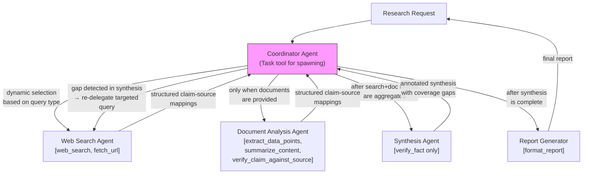

# Scenario 3: Multi-Agent Research System

> **Primary domains:** 1 (Agentic Architecture & Orchestration), 2 (Tool Design & MCP Integration), 5 (Context Management & Reliability)
> **Task statements in play:** 1.2, 1.3, 1.6, 1.7, 2.1, 2.3, 2.4, 5.1, 5.3, 5.6
> **Exam weight:** The richest multi-agent scenario on the exam. Almost every Domain 1 concept is testable here. Study this alongside Scenario 1 — they share Domain 1 and 5 coverage but test fundamentally different agent patterns (single agent vs. coordinator/subagent hierarchy).

---

## Table of Contents
1. [The Scenario](#1-the-scenario)
2. [System Architecture](#2-system-architecture)
3. [Role of Each Domain in This Scenario](#3-role-of-each-domain-in-this-scenario)
4. [What This Scenario Tests From You](#4-what-this-scenario-tests-from-you)
5. [Domain Task-Statement Walkthrough](#5-domain-task-statement-walkthrough)
6. [Scenario-Specific Traps](#6-scenario-specific-traps)
7. [Practice Question Bank](#7-practice-question-bank)
8. [Answer Key](#8-answer-key)
9. [Quick-Recall Cheat Sheet](#9-quick-recall-cheat-sheet)

---

## 1. The Scenario

You are building a **multi-agent research system** using the Claude Agent SDK. The system researches topics on demand and produces comprehensive, cited reports. It uses a **hub-and-spoke coordinator/subagent architecture** with four specialized subagents:

| Agent | Role | Tools available |
|---|---|---|
| **Coordinator** | Decomposes research queries, selects subagents, routes tasks, aggregates results, drives iterative refinement | `Task` (to spawn subagents) |
| **Web Search Agent** | Finds current information from live web sources | `web_search`, `fetch_url` |
| **Document Analysis Agent** | Reads and extracts information from provided documents | `extract_data_points`, `summarize_content`, `verify_claim_against_source` |
| **Synthesis Agent** | Combines findings from search and analysis into coherent narratives | `verify_fact` (scoped cross-role tool) |
| **Report Generator** | Formats the synthesized findings into a structured final report | `format_report` |

**The canonical failure examples embedded in this scenario:**
- `analyze_content` and `analyze_document` had near-identical descriptions → misrouting
- The synthesis agent was given 18 tools including `web_search` → attempted direct web queries
- Coordinator always routes all 4 subagents regardless of query type → slow, wasteful, incomplete

**Business requirements:**
- Every claim in the final report must be traceable to a specific source (URL, document name, excerpt)
- Conflicting statistics from different sources must be annotated with both values — never silently resolved
- Publication dates must be included in all citations to prevent temporal misinterpretation
- The system must handle partial failures (one subagent unavailable) gracefully — not terminate the entire research run

---

## 2. System Architecture



**Key architectural facts to memorize:**
- All inter-subagent communication flows **through the coordinator** — subagents never call each other directly
- Subagents have **no access to the coordinator's conversation history** — context must be explicitly passed in every `Task` prompt
- The synthesis agent must NOT have `web_search` in its `allowedTools` — it uses only coordinator-provided findings
- Parallel subagent invocation = **multiple `Task` calls in one coordinator turn**, not across separate turns

---

## 3. Role of Each Domain in This Scenario

| Domain | Role | Tested? |
|---|---|---|
| **Domain 1 — Agentic Architecture** | **Primary.** Owns the coordinator/subagent hub-and-spoke pattern, dynamic routing, parallel spawning, iterative refinement loop, and session forking | Yes — 1.2, 1.3, 1.6, 1.7 |
| **Domain 2 — Tool Design & MCP** | **Primary.** Owns per-agent tool scoping (the 18-tool anti-pattern), tool description overlap (`analyze_content` vs `analyze_document`), and MCP resource usage | Yes — 2.1, 2.3, 2.4 |
| **Domain 3 — Claude Code Config** | **Not tested.** This is an Agent SDK system, not a Claude Code workflow | No |
| **Domain 4 — Prompt Engineering** | **Not tested.** No JSON-schema extraction or structured-output narrative | No |
| **Domain 5 — Context & Reliability** | **Primary.** Owns cross-agent information fidelity: structured findings, position effects in synthesis, error propagation between agents, source provenance, and conflict handling | Yes — 5.1, 5.3, 5.6 |

**The short version:** Domains 1, 2, and 5 are all primary here. Domain 1 = how the coordinator thinks and delegates. Domain 2 = what tools each agent gets and how they're described. Domain 5 = how findings flow between agents without losing accuracy, attribution, or context.

---

## 4. What This Scenario Tests From You

This scenario tests your ability to **design a correct coordinator/subagent system from the ground up** — and to diagnose failures in one that's already built. The exam will describe a broken multi-agent system (fixed routing, overloaded tools, prose findings, silently resolved conflicts) and ask you to identify the root cause and the correct fix. The central trap: the wrong answers always fix the symptom at the wrong layer (e.g., fixing a coordinator decomposition problem by changing subagent instructions).

### Knowledge you must have cold

| Must know | Detail |
|---|---|
| Hub-and-spoke rule | All inter-subagent communication goes through the coordinator — subagents never call each other directly |
| Zero inherited context | Subagents have no access to the coordinator's conversation history — every finding must be explicitly passed in the `Task` prompt |
| Parallel spawning | Multiple `Task` calls in **one coordinator response** = parallel; across separate turns = sequential |
| 18-tool anti-pattern | Too many tools degrades tool selection — restrict each subagent to 4-5 role-relevant tools |
| `allowedTools` enforcement | Remove a tool from `allowedTools` to deterministically prevent an agent from using it; don't rely on instructions |
| Coverage gap root cause | Missing coverage = coordinator decomposition problem, not subagent instructions problem |
| Structured claim-source mapping | `{ claim, source_url, date, excerpt }` per finding — not prose; preserves attribution for synthesis |
| Conflict annotation | Two credible sources disagree → annotate both with attribution; never silently pick one |
| `fork_session` | Creates independent branches from a shared baseline for divergent research angles |
| `publication_date` requirement | Required in every citation to distinguish temporal differences from real conflicts |

### Judgment calls the exam will ask you to make

| Exam question type | The judgment you must apply |
|---|---|
| "Report misses entire topic area — fix it" | Fix coordinator's scope decomposition (assign the missing subtopic), not subagent instructions |
| "Synthesis ignores document analysis findings — why?" | Subagents have no inherited context — the findings weren't explicitly passed to synthesis |
| "Synthesis agent performs its own web searches — fix it" | Remove `web_search` from its `allowedTools` (deterministic), not a system-prompt instruction |
| "Subagents run sequentially instead of in parallel — fix it" | Emit all `Task` calls in one coordinator response, not across separate turns |
| "Two sources report conflicting revenue figures — extraction should?" | Annotate both with source, date, methodology; set `conflict_detected: true` |
| "Synthesis misses middle-section findings from a long aggregated input — fix it" | Move key findings summary to beginning of input; add explicit section headers |

### Wrong-answer patterns to immediately recognize and reject

- Any answer that has a subagent **call another subagent directly** — all routing goes through the coordinator
- Any answer that passes findings to synthesis as **plain text prose** — attribution is lost; structured data required
- Any answer that **silently picks one conflicting value** — both must be preserved and annotated
- Any answer that fixes a coverage gap by **changing subagent instructions** — the coordinator's decomposition is the root cause
- Any answer that uses **system-prompt instructions** to prevent a subagent from using a tool — `allowedTools` is the deterministic mechanism

---

## 5. Domain Task-Statement Walkthrough

### 1.2 — Orchestrating Multi-Agent Systems

**How it shows up here:**
The coordinator's routing logic is the most testable aspect of this scenario. Two failure modes appear:
1. **Fixed pipeline**: coordinator always routes through all 4 subagents regardless of the query — a simple factual lookup still goes to the document analysis agent even when no documents were provided
2. **Coverage gaps**: synthesis output has topic areas missing — the root cause is the coordinator's decomposition (how it split the research question), not the subagents' individual work

**The iterative refinement loop:**
```
Coordinator decomposes query → assigns subtopics to subagents
→ collects structured findings → routes to synthesis agent
→ evaluates synthesis for coverage gaps
→ if gaps found: re-delegates targeted queries to search/doc agents
→ re-invokes synthesis with augmented findings
→ repeats until coverage is sufficient
```

**Right vs. wrong:**

| ✅ Correct | ❌ Wrong |
|---|---|
| Coordinator evaluates synthesis output for completeness and re-delegates targeted queries when gaps are found | Coordinator runs the pipeline once and accepts whatever synthesis produces |
| Dynamic routing: a query that needs only web search skips the document analysis agent | Fixed pipeline: all queries always route through all 4 agents |
| When research is incomplete, the coordinator re-delegates with targeted sub-queries rather than asking subagents to "try harder" | Instructing subagents to produce better output without changing the query or scope |
| Coverage gap in synthesis → fix coordinator's decomposition (assign more specific subtopics) | Coverage gap → fix subagent instructions |

---

### 1.3 — Subagent Invocation, Context Passing, and Spawning

**How it shows up here:**
Subagents do not share memory with the coordinator. Every piece of context the subagent needs must be explicitly included in its `Task` prompt. Two common mistakes: (1) assuming subagents "know" what the coordinator found, and (2) spawning parallel subagents across multiple turns instead of one.

**Context passing requirement:**
```
Bad prompt: "Research the company's revenue trends."
Good prompt: "Research revenue trends for TechCorp (ticker: TECH) for 2022-2024.
             Prior search found their 2022 revenue was $4.2B. Focus on growth drivers
             and analyst forecasts. Return: { claim, source_url, date, excerpt } per finding."
```

**Parallel spawning — the right way:**
```
# ONE coordinator turn — emits multiple Task calls simultaneously
Task("web_search_agent", "Research Q3 2024 smartphone market share")
Task("web_search_agent", "Research Q3 2024 smartphone battery technology trends")
Task("web_search_agent", "Research Q3 2024 smartphone pricing trends")
```

NOT across 3 separate coordinator turns.

**Right vs. wrong:**

| ✅ Correct | ❌ Wrong |
|---|---|
| Include complete prior findings in the subagent's prompt (search results + doc analysis) before routing to synthesis | Let synthesis "figure out what search and analysis found" — it has no access to that context |
| Emit multiple `Task` calls in a single coordinator response to run subagents in parallel | Spawn one subagent, wait for its result, then spawn the next — sequential by default |
| Use structured data in subagent prompts: separate content from metadata (source URL, document name, page) | Pass findings as a prose paragraph — attribution lost in synthesis |
| Coordinator prompts specify research goals and quality criteria, not step-by-step procedures | Tell subagents exactly which searches to run — removes adaptability |

---

### 1.6 — Task Decomposition for Coverage

**How it shows up here:**
When a research report has gaps (e.g., missing coverage of regulatory impacts on the topic), the most common exam trap is to fix the subagent instructions rather than the coordinator's decomposition strategy. The coordinator is responsible for scoping — if two subagents cover overlapping subtopics or one subtopic has no agent assigned, that's a coordinator design problem.

**Right vs. wrong:**

| ✅ Correct | ❌ Wrong |
|---|---|
| Assign distinct subtopics/source types per subagent to minimize duplication (e.g., Agent A: market data; Agent B: regulatory filings; Agent C: industry news) | Give all subagents the same broad research mandate — they'll duplicate each other |
| When coverage is incomplete, the coordinator adds a targeted sub-query with a specific gap description | When coverage is incomplete, ask the synthesis agent to "be more comprehensive" |
| Coordinator partitions scope before delegation — each agent knows exactly what it owns | Subagents self-select their research scope — no partitioning by coordinator |

---

### 1.7 — Session Forking for Research Divergence

**How it shows up here:**
A research question may have two radically different investigative angles (e.g., "EV market share: optimistic analyst forecasts" vs. "EV market share: skeptical regulatory constraints"). Both need to be explored from the same analysis baseline.

**Right vs. wrong:**

| ✅ Correct | ❌ Wrong |
|---|---|
| `fork_session` from the shared baseline — two independent research branches, each starting from the same findings | Start two entirely separate sessions — each branch re-does all the baseline research |
| Fork after initial analysis is complete — both branches inherit the baseline context | Fork before any analysis — branches miss out on shared context |

---

### 2.1 — Tool Interface Design

**How it shows up here:**
The canonical tool-name overlap example for the entire exam is in this scenario: `analyze_content` and `analyze_document` had near-identical descriptions, causing the web search agent to use the document analysis tool and vice versa.

**The problem and fix:**

```
Before (overlap):
  analyze_content: "Analyzes content and extracts key information"
  analyze_document: "Analyzes documents and extracts key information"
  → Model cannot distinguish these; misroutes reliably

After (differentiated):
  extract_web_results: "Processes web search results. Input: JSON array of search result objects
                       with url, title, snippet fields. Output: structured findings with source URLs.
                       Use after web_search calls. Do NOT use for PDF or document analysis."
  extract_data_points: "Extracts structured data from provided document text. Input: document content
                       as string. Output: { claim, page, confidence }. Use for PDFs and uploaded docs.
                       Do NOT use for web search results."
```

**Right vs. wrong:**

| ✅ Correct | ❌ Wrong |
|---|---|
| Rename tools and rewrite descriptions to eliminate any functional overlap; include when-to-use vs. when-NOT-to-use | Add a note to the system prompt: "Use analyze_content for web results and analyze_document for PDFs" — keyword-sensitive, overrideable |
| Split a generic tool into purpose-specific tools with distinct input/output contracts | Merge overlapping tools into one super-tool with a `type` parameter |
| Review system prompts for keywords that create unintended tool associations | Assume tool descriptions alone are sufficient without auditing system prompt interactions |

---

### 2.3 — Tool Distribution Across Agents

**How it shows up here:**
The original synthesis agent was given 18 tools — all tools from the coordinator, search, and document analysis agents combined. The result: the synthesis agent attempted live web searches itself, bypassing the coordinator.

**The 18-tool anti-pattern:**
```
Too many tools → model's decision space too large → misrouting increases
Synthesis agent should have: 1 tool (verify_fact)
Not: web_search, fetch_url, extract_data_points, summarize_content, format_report, ...
```

**Scoped cross-role tools:**
The synthesis agent gets ONE cross-role tool: `verify_fact` — a constrained alternative that validates a claim against coordinator-provided context, without giving it live web access.

**Right vs. wrong:**

| ✅ Correct | ❌ Wrong |
|---|---|
| Remove `web_search` from synthesis agent's `allowedTools` — deterministic prevention | Add "The synthesis agent should not perform web searches" to the system prompt — probabilistic |
| Restrict each subagent to 4-5 tools relevant to its role | Give agents access to all tools and rely on the system prompt to restrict usage |
| Provide a scoped `verify_fact` cross-role tool for high-frequency needs in synthesis | Route every verification request through the coordinator — adds latency for a high-frequency operation |
| `tool_choice: "any"` on subagents to guarantee they return structured tool results rather than prose | `tool_choice: "auto"` — subagent may skip tool use and return prose |

---

### 2.4 — MCP Server Integration

**How it shows up here:**
The team wants to integrate Jira for research task tracking. The web search agent performs slower searches than expected because it uses Claude Code's built-in Grep instead of the more capable MCP-based semantic search tool.

**Right vs. wrong:**

| ✅ Correct | ❌ Wrong |
|---|---|
| Use an existing Jira community MCP server — well-tested, maintained, standard integration | Build a custom MCP server for Jira from scratch — unnecessary effort for a standard integration |
| Enhance MCP tool descriptions to explain why they're superior to built-in tools and when to prefer them | Leave MCP tool descriptions minimal — agent defaults to built-in tools it already "knows" |
| Expose a content catalog as an MCP resource (e.g., list of available research document summaries) — agent can see what's available without exploratory tool calls | Make the agent search blindly through available documents |

---

### 5.1 — Context Management in Synthesis

**How it shows up here:**
The synthesis agent receives aggregated findings from both the web search and document analysis agents. If these findings are passed as one large block of text, critical information from middle sections may be missed (the "lost in the middle" effect), and the synthesis output will have coverage gaps.

**Right vs. wrong:**

| ✅ Correct | ❌ Wrong |
|---|---|
| Place the key findings summary at the **beginning** of the aggregated input — beginning of context = reliably processed | Append the key findings summary at the end of a long document |
| Organize detailed results with explicit section headers per topic area (## Market Data / ## Regulatory / ## Analyst Views) | Present all findings as one undifferentiated block |
| Require subagents to include metadata in structured outputs: `{ claim, source_url, date, excerpt, relevance_score }` | Pass findings as free-form prose — metadata lost in synthesis |
| Modify upstream agents to return structured key facts instead of verbose content when downstream context budget is limited | Allow verbose content to pass through regardless of downstream context constraints |

---

### 5.3 — Error Propagation in Multi-Agent Systems

**How it shows up here:**
A search subagent times out due to a third-party search API outage. This is not a failure of the research query itself — it's a transient infrastructure failure. The coordinator needs enough information to decide: retry, use alternative sources, or proceed with partial data.

**Two anti-patterns:**
1. **Silent suppression**: subagent returns empty results `[]` as if the query returned no findings — coordinator thinks there are no results on that topic
2. **Cascade termination**: subagent failure crashes the coordinator — the entire research run terminates for a single agent's problem

**Right vs. wrong:**

| ✅ Correct | ❌ Wrong |
|---|---|
| Subagent returns structured error: `{ failure_type: "transient", attempted_query: "...", partial_results: [...], alternatives: ["try duckduckgo", "try bing"] }` | Subagent returns `{ results: [] }` — coordinator interprets as "no results on this topic" |
| Subagent implements local recovery for transient failures (1-2 retries) before propagating to coordinator | Propagate every timeout immediately to coordinator, creating retry storms |
| Synthesis output annotates which topic areas have limited coverage due to unavailable sources | Synthesis presents all areas with equal confidence, regardless of source availability |
| Coordinator treats search unavailability differently from "search returned zero relevant results" | Coordinator treats all empty results identically |

---

### 5.6 — Information Provenance and Conflict Handling

**How it shows up here:**
Two financial news sources report conflicting Q3 revenue figures for the same company: Source A ($4.2B), Source B ($3.9B). Both are credible. The synthesis agent must handle this without picking one value arbitrarily or averaging the two.

**Claim-source mapping structure:**
```json
{
  "claim": "TechCorp Q3 2024 revenue",
  "source_a": {
    "value": "$4.2B",
    "source": "Bloomberg, Oct 15 2024",
    "url": "bloomberg.com/...",
    "methodology": "GAAP reported"
  },
  "source_b": {
    "value": "$3.9B",
    "source": "Reuters, Oct 16 2024",
    "url": "reuters.com/...",
    "methodology": "Non-GAAP adjusted"
  },
  "conflict_detected": true,
  "coordinator_note": "Different accounting methodologies — present both"
}
```

**Right vs. wrong:**

| ✅ Correct | ❌ Wrong |
|---|---|
| Annotate the conflict: present both values with source attribution and methodological context | Silently pick the higher/lower/most-recent value |
| Require `publication_date` in every claim-source mapping to prevent temporal misinterpretation | Omit dates — reader cannot tell if a 2019 statistic conflicts with a 2024 statistic or if they're from different time periods |
| Document analysis agent completes analysis with conflicting values included and explicitly annotated — coordinator decides reconciliation | Document analysis agent resolves the conflict before passing to synthesis |
| Synthesis report distinguishes "well-established findings" from "contested findings" with separate sections | Present all findings with uniform confidence |

---

## 6. Scenario-Specific Traps

| Trap | Why it's wrong | Correct approach |
|---|---|---|
| Fixed pipeline routing all queries through all 4 subagents regardless of type | Wastes compute; a simple factual query still goes to document analysis even with no documents | Dynamic routing based on query complexity — coordinator selects only needed subagents |
| Passing research findings as a prose text blob to the synthesis agent | Attribution is lost; synthesis can't cite specific sources for specific claims | Pass structured `{ claim, source_url, date, excerpt }` mappings |
| Synthesis agent has `web_search` in its `allowedTools` | Synthesis agent bypasses the coordinator and performs direct web searches — breaks hub-and-spoke observability | Remove `web_search` from synthesis's `allowedTools` (deterministic) — not a system-prompt instruction |
| Synthesis agent given 18 tools instead of 4-5 | Tool selection degrades; agent misuses tools outside its specialization | Restrict each subagent to role-appropriate tools only |
| Fixing coverage gaps by changing subagent instructions | If two subtopics overlap or one has no agent assigned, that's a coordinator decomposition problem | Fix coordinator's scope partitioning — not subagent behavior |
| Search subagent returns `[]` on timeout | Coordinator interprets as "no findings on this topic" and proceeds — gives incomplete research | Return structured error with `failure_type`, `attempted_query`, `partial_results`, and `alternatives` |
| Spawning parallel subagents across 3 separate coordinator turns | Subagents run sequentially, not in parallel — loses the parallelism benefit | Emit multiple `Task` calls in ONE coordinator response |
| Conflicting statistics silently resolved by picking one | Destroys source fidelity; report claims a precision it doesn't have | Annotate conflict with both values + sources; let the coordinator/human decide |

---

## 7. Practice Question Bank

> **Instructions:** All questions are anchored to Scenario 3. Read each in the context of the multi-agent research system with coordinator + 4 subagents described above.

---

### 1.2 — Coordinator Orchestration (3 questions)

**Q1.** The research system is asked a simple factual question: "What is the current CEO of TechCorp?" The system routes this through all 4 subagents — web search, document analysis, synthesis, and report generation — regardless of the query's simplicity. What is the primary problem with this design?

- A) The synthesis agent cannot handle simple factual questions
- B) The coordinator lacks dynamic routing logic — it runs a fixed pipeline for all queries regardless of complexity or type
- C) The report generation agent produces overly formatted output for simple answers
- D) Simple queries should bypass the coordinator entirely and go directly to the web search agent

---

**Q2.** After synthesis, the research report is missing coverage of regulatory impacts on the topic. The synthesis agent's output summary explicitly states "limited findings on regulatory aspects." What is the correct fix?

- A) Update the synthesis agent's system prompt to be more comprehensive about regulatory topics
- B) Give the synthesis agent access to the web_search tool so it can fill gaps itself
- C) The coordinator should re-delegate a targeted query specifically about regulatory impacts to the web search agent and re-invoke synthesis with the augmented findings
- D) Ask the document analysis agent to search for regulatory documents

---

**Q3.** The coordinator receives synthesis output that mentions conflicting claims but doesn't specify which sources conflict. To resolve this, the coordinator re-delegates to the document analysis agent with the request: "Find the source of the conflicting revenue figures mentioned in the synthesis." This is an example of:

- A) An anti-pattern — the coordinator should never re-invoke subagents after synthesis
- B) Iterative refinement — the coordinator evaluates synthesis output for gaps and re-delegates targeted queries until coverage is sufficient
- C) Error recovery — a subagent failed and the coordinator is retrying
- D) Parallel spawning — the coordinator is running document analysis and synthesis simultaneously

---

### 1.3 — Subagent Invocation and Context Passing (3 questions)

**Q4.** The synthesis agent consistently produces output that ignores findings from the document analysis agent, even though the document analysis agent completed successfully. Investigation shows the synthesis agent's prompt says: "Synthesize all available research findings." What is the root cause?

- A) The synthesis agent has a tool conflict that prevents it from accessing document analysis results
- B) Subagents do not automatically inherit the coordinator's conversation history — the document analysis findings must be explicitly included in the synthesis agent's prompt
- C) The synthesis agent's context window is too small to process document analysis output
- D) The synthesis agent needs permission to access the document analysis agent's memory

---

**Q5.** The coordinator needs to research three different subtopics simultaneously to meet a deadline. Currently, it spawns them sequentially — first subagent A completes, then B, then C. To achieve true parallel execution, the coordinator must:

- A) Use Python's `asyncio` to run the subagent calls concurrently
- B) Emit all three `Task` calls in a single coordinator response — this is what triggers parallel execution in the Agent SDK
- C) Spawn the three subagents in three separate coordinator turns but instruct them to start simultaneously
- D) Use a separate thread pool to manage subagent execution outside the coordinator's main loop

---

**Q6.** You are designing the prompt that the coordinator sends to the synthesis agent. The coordinator has aggregated: (A) 12 web search findings with source URLs, and (B) 8 document analysis findings with document names and page numbers. Which prompt structure is correct?

- A) "Synthesize the following research findings: [paste all findings as a single prose paragraph]"
- B) "Based on your knowledge and the research topic, write a synthesis of current trends in [topic]"
- C) "Synthesize the following structured findings, preserving source attribution:\n\nWEB FINDINGS:\n[{claim, source_url, date, excerpt} × 12]\n\nDOCUMENT FINDINGS:\n[{claim, document_name, page, excerpt} × 8]"
- D) "The web search found 12 results and document analysis found 8 results. Write a synthesis."

---

### 1.6 — Task Decomposition (2 questions)

**Q7.** The coordinator assigns the same research mandate to both the web search agent and the document analysis agent: "Research TechCorp's financial performance." After both agents return findings, the synthesis report contains significant duplication. What went wrong?

- A) The synthesis agent failed to deduplicate the findings
- B) The coordinator did not partition the research scope — both agents received identical mandates with no domain separation
- C) The web search agent should have checked what the document analysis agent was researching before starting
- D) The document analysis agent should have access to the web search agent's findings before starting its own research

---

**Q8.** A research report on the electric vehicle market is consistently missing coverage of battery technology advances. The coordinator decomposes the research as: "Market share data" (Agent 1) and "Consumer adoption trends" (Agent 2). Which is the correct diagnosis?

- A) The synthesis agent needs better instructions to cover battery technology
- B) The web search agent's search tool lacks access to technical publications
- C) The coordinator's decomposition has a gap — battery technology is not assigned to any subagent
- D) The document analysis agent should automatically detect and cover uncovered topics

---

### 1.7 — Session Forking (2 questions)

**Q9.** A research coordinator has completed an initial analysis of the EV market. The team wants to explore two divergent research angles: (A) optimistic growth projections, and (B) regulatory headwinds limiting adoption. Both angles should start from the same initial analysis. The correct approach is:

- A) Start two completely separate research sessions, each beginning the EV market analysis from scratch
- B) Explore angle A first; if the results are interesting, explore angle B in the same session
- C) Use `fork_session` from the shared baseline — two independent research branches inherit the completed initial analysis
- D) Create two different system prompts, one optimistic and one pessimistic, and run them in parallel

---

**Q10.** After forking the research session, one branch explores optimistic projections (angle A) and the other explores regulatory headwinds (angle B). The team wants to compare findings side by side. The fork pattern ensures:

- A) Both branches share live context — changes in one branch automatically appear in the other
- B) Each branch is completely independent — findings in one do not affect the other
- C) One branch is the "primary" and the other is a read-only copy
- D) Both branches merge automatically after 24 hours

---

### 2.1 — Tool Interface Design (2 questions)

**Q11.** The web search agent is calling `analyze_document` when it should be calling `analyze_content` (the tool designed for web results). Investigation shows both tools have nearly identical descriptions: "Analyzes content and extracts information." What is the correct fix?

- A) Add a note to the coordinator's system prompt: "The web search agent should use analyze_content, not analyze_document"
- B) Rename and rewrite both tool descriptions to eliminate overlap: `extract_web_results` for web search output (with web-specific input format and example) and `extract_data_points` for document text (with document-specific input format)
- C) Remove one of the two tools and add a `type` parameter to the remaining tool
- D) Keep the descriptions as-is but add few-shot examples showing correct tool selection

---

**Q12.** After differentiating the tool descriptions, the coordinator's system prompt still contains: "When analyzing research content, call analyze_content." This instruction is now causing the document analysis agent to incorrectly use the web-focused tool for PDF documents. What is the root cause?

- A) The document analysis agent's `allowedTools` list is incorrectly configured
- B) The system prompt's keyword-sensitive instruction "research content" creates an unintended tool association that overrides the corrected tool descriptions
- C) The renamed tool `extract_web_results` is not yet deployed to the document analysis agent
- D) The document analysis agent needs to be retrained on the new tool descriptions

---

### 2.3 — Tool Distribution (3 questions)

**Q13.** The synthesis agent's `allowedTools` list includes `web_search`, `fetch_url`, `extract_data_points`, `summarize_content`, `verify_fact`, `format_report`, and 11 other tools — a total of 18. The synthesis agent begins performing direct web searches during synthesis. What is the most reliable fix?

- A) Add "Do not perform web searches during synthesis" to the synthesis agent's system prompt
- B) Remove `web_search` and `fetch_url` from the synthesis agent's `allowedTools` list — the agent cannot use tools it doesn't have access to
- C) Add a `PreToolUse` hook that intercepts `web_search` calls from the synthesis agent and returns an error
- D) Instruct the coordinator to tell the synthesis agent not to search the web before routing to it

---

**Q14.** The synthesis agent needs to occasionally verify a specific claim against the research findings already collected by the coordinator. Giving it access to the full `web_search` tool is too broad. What is the correct scoped alternative?

- A) Allow the synthesis agent to call the web search agent directly when it needs verification
- B) Give the synthesis agent read-only access to the coordinator's conversation history
- C) Provide a scoped `verify_fact` tool that validates claims against the coordinator-provided findings without giving live web access
- D) Route all verification requests through the coordinator — the synthesis agent must wait for the coordinator to delegate and return

---

**Q15.** After restricting the synthesis agent to 4 tools (down from 18), you notice improved tool selection accuracy. This improvement is BEST explained by:

- A) The synthesis agent has more time to process each tool call since there are fewer competing calls
- B) Reducing the number of tools decreases decision complexity — with fewer options, the model makes more accurate selections among the available tools
- C) The 4 remaining tools have better descriptions than the 14 that were removed
- D) The synthesis agent's context window is now smaller, forcing it to be more focused

---

### 2.4 — MCP Integration (2 questions)

**Q16.** The web search agent uses Claude Code's built-in Grep for searching through indexed research documents, despite a more capable MCP-based semantic search tool being configured. The agent consistently prefers Grep. What is the most effective fix?

- A) Remove the built-in Grep tool from the web search agent's `allowedTools`
- B) Add detailed descriptions to the MCP semantic search tool explaining its capabilities, what it returns, and why it should be preferred over Grep for semantic research queries
- C) Add a note to the coordinator's system prompt: "The web search agent should prefer the MCP search tool"
- D) Remove Grep from Claude Code's built-in tools globally

---

**Q17.** The team needs to track research tasks in Jira. An engineer proposes building a custom MCP server to integrate Jira. A teammate notes that community Jira MCP servers already exist. What is the correct approach?

- A) Build a custom server — control over the implementation is worth the development cost
- B) Use the existing community Jira MCP server — standard integrations have well-maintained community servers; reserve custom builds for team-specific workflows
- C) Use a REST API directly instead of MCP for standard integrations
- D) Avoid Jira integration — MCP adds too much complexity for task tracking

---

### 5.1 — Context in Synthesis (2 questions)

**Q18.** The synthesis agent receives a 15,000-token aggregated input with web findings, document findings, and a key findings summary — in that order, with the summary at the end. The synthesis output consistently omits findings from the web search section. What is the most likely cause and fix?

- A) The web search findings have formatting errors that the synthesis agent cannot parse
- B) The "lost in the middle" effect — findings in the middle of long inputs are underprocessed. Fix: move the key findings summary to the beginning of the aggregated input; organize web/document findings with explicit section headers
- C) The synthesis agent's context window is too small — upgrade to a model with a larger context window
- D) The web search agent is returning findings in the wrong format

---

**Q19.** To keep the synthesis agent's context within budget on broad research topics, you need to change how the web search and document analysis agents structure their output. The correct approach is:

- A) Ask subagents to be "brief" in their reports
- B) Truncate subagent output to a fixed character limit before passing to synthesis
- C) Instruct subagents to return structured key facts, source citations, and relevance scores instead of verbose content and reasoning chains — the synthesis agent gets compact structured data instead of full prose
- D) Run synthesis in multiple passes, processing one subagent's output at a time

---

### 5.3 — Error Propagation (2 questions)

**Q20.** The web search agent encounters a timeout while querying a financial news API. It returns `{ "results": [] }` to the coordinator. The coordinator concludes there is no financial news on the research topic and proceeds without that information. This is wrong because:

- A) The coordinator should always retry failed subagents 3 times before accepting empty results
- B) An empty results array is indistinguishable from a valid "no results found" response — the coordinator cannot tell whether the search was attempted and failed or attempted and found nothing. The subagent should return a structured error response instead.
- C) The coordinator should escalate to a human when any subagent returns empty results
- D) Empty results from a web search always indicate a timeout — the coordinator should treat them as errors

---

**Q21.** A search subagent has implemented local retry logic for transient failures. After 2 retries, the API is still unavailable. The subagent should:

- A) Continue retrying indefinitely until the API responds
- B) Return a success response with whatever partial data it gathered before the failure
- C) Propagate a structured error to the coordinator: `{ failure_type: "transient_persistent", attempted_query: "...", partial_results: [...], alternatives: ["try archive.org", "try alternative_api"] }` — the coordinator decides the recovery strategy
- D) Terminate the entire research session since a key data source is unavailable

---

### 5.6 — Provenance and Conflict Handling (1 question)

**Q22.** The synthesis agent finds that Bloomberg reports TechCorp's Q3 2024 revenue as $4.2B (GAAP) and Reuters reports it as $3.9B (non-GAAP adjusted). Both sources are credible. The synthesis agent should:

- A) Use the average: $4.05B
- B) Use the higher figure from the more reputable source
- C) Use the more recent report
- D) Present both values with their respective sources, methodologies, and a `conflict_detected` annotation — let the final report distinguish the two and explain the methodological difference

---

## 8. Answer Key

**Q1: B**
Fixed-pipeline routing ignores query complexity and always incurs the overhead of all 4 agents. The coordinator should dynamically select which subagents to invoke based on the query's requirements. Simple factual queries need only the web search agent.

**Q2: C**
The coordinator's iterative refinement loop should detect the coverage gap in synthesis output and re-delegate a targeted query. Fixing the synthesis agent's instructions (A) doesn't address missing source material. Giving synthesis web access (B) violates hub-and-spoke. The document analysis agent (D) is for provided documents, not independent research.

**Q3: B**
This is the iterative refinement loop in action: coordinator evaluates synthesis → finds gaps → re-delegates targeted queries → re-invokes synthesis. This is a designed behavior, not an anti-pattern or error recovery.

**Q4: B**
Subagents have completely isolated context — they do not inherit the coordinator's conversation history. Any findings the coordinator wants the synthesis agent to use must be explicitly passed in the synthesis agent's `Task` prompt. The phrase "all available research findings" means nothing to a subagent that hasn't seen any of those findings.

**Q5: B**
Parallel execution in the Agent SDK is achieved by emitting multiple `Task` calls in a single coordinator response. The SDK handles concurrent execution. Sequential spawning (waiting for one before starting the next) negates the parallelism benefit. Python asyncio (A) and thread pools (D) are not the right abstraction level.

**Q6: C**
The synthesis agent must receive structured findings with source attribution preserved. Option C passes each finding as a structured object with the metadata needed for citation. Option A destroys attribution. Option B ignores the research findings entirely. Option D gives counts without content.

**Q7: B**
When both agents receive identical mandates, they naturally explore the same sources and produce overlapping findings. The coordinator must partition scope before delegation — e.g., Agent 1: financial filings; Agent 2: news and analyst reports.

**Q8: C**
The coordinator's decomposition missed an entire subtopic. Battery technology is not assigned to any subagent — there's no agent researching it. The fix is to add a subtopic to the coordinator's decomposition, not to fix individual agent instructions or tools.

**Q9: C**
`fork_session` creates two independent branches from the shared baseline, so both divergent research angles start from the same completed initial analysis without redoing the baseline work. Starting separate sessions (A) duplicates the baseline work. Sequential exploration (B) means angle B is influenced by angle A's findings.

**Q10: B**
Fork branches are completely independent — they do not share context after forking. Changes in one branch do not affect the other. This isolation is the entire point: to explore divergent approaches without interference.

**Q11: B**
Renaming tools and rewriting descriptions to eliminate functional overlap is the correct fix for tool misrouting. System prompt instructions (A) are keyword-sensitive and overrideable by better descriptions. Merging tools with a `type` parameter (C) creates one overloaded ambiguous tool. Few-shot examples (D) help but don't fix the underlying description overlap.

**Q12: B**
System prompt keywords create unintended tool associations. "Analyze research content" maps to any tool with "content" in its name, overriding the corrected descriptions. The fix is to remove or rephrase the keyword-sensitive instruction in the system prompt.

**Q13: B**
Removing `web_search` from `allowedTools` is deterministic — the agent physically cannot call a tool it doesn't have access to. System prompt instructions (A, D) are probabilistic. A `PreToolUse` hook (C) works but is a more complex implementation of the same enforcement that `allowedTools` provides more cleanly.

**Q14: C**
A scoped `verify_fact` tool provides the synthesis agent with limited, controlled fact-verification capability against coordinator-provided findings — without live web access. Direct subagent calls (A) violate hub-and-spoke. Coordinator history access (B) is not how subagent context works. Full coordinator routing (D) adds unnecessary latency for a high-frequency operation.

**Q15: B**
With fewer tools, the model's decision space for tool selection is smaller — it makes more accurate choices from a reduced set. This is the core reason to restrict tool access per agent. Tool description quality (C) didn't change — only the number of tools changed.

**Q16: B**
When agents prefer built-in tools over MCP tools, the fix is to improve the MCP tool's description so the agent understands its capabilities and why it should be preferred for specific query types. Removing Grep (A) is too aggressive. System prompt instructions (C) are keyword-sensitive. Removing Grep globally (D) affects all agents.

**Q17: B**
Existing community MCP servers for standard integrations (Jira, GitHub, Slack) are well-maintained and save significant development time. Custom MCP servers should be reserved for team-specific workflows that don't have community solutions.

**Q18: B**
"Lost in the middle" effect: models reliably process information at the beginning and end of long inputs. Findings in the middle section (web search, in this case) receive less attention. Fix: move the key findings summary to the beginning; use explicit section headers throughout.

**Q19: C**
Structured key facts with relevance scores give the synthesis agent the information it needs in a compact form — preserving attribution and relevance without the full reasoning chains and verbose content. "Be brief" (A) is probabilistic. Fixed truncation (B) may cut off critical attribution. Multi-pass (D) works but is more complex and slower.

**Q20: B**
The root problem is that `{ "results": [] }` is a valid successful response when a search finds nothing. The coordinator correctly interprets it as "no results" — it has no way to know this was a failure. The solution is for the subagent to return a clearly typed error response that distinguishes failure from empty results.

**Q21: C**
After exhausting local retries, the subagent should propagate a structured error with everything the coordinator needs to make a recovery decision: what was attempted, what partial results were gathered, and what alternatives might work. Endless retries (A) loop infinitely. Returning success with partial data (B) hides the failure. Terminating the session (D) is disproportionate for one unavailable data source.

**Q22: D**
Both figures are correct in their respective methodological contexts. The synthesis agent's job is not to resolve the conflict but to preserve it with full attribution so the final report can present the information accurately. Averaging (A), picking one (B, C), or silently resolving the conflict destroys the precision of the source data.

---

## 9. Quick-Recall Cheat Sheet

**Coordinator orchestration (1.2)**
- Dynamic routing = select subagents based on query type; don't always run all 4
- Iterative refinement loop = evaluate synthesis → detect gaps → re-delegate targeted queries → re-synthesize
- Coverage gaps → fix coordinator decomposition, not subagent instructions

**Subagent context passing (1.3)**
- Subagents have zero inherited context — every finding must be explicitly passed in the prompt
- Parallel spawning = multiple `Task` calls in ONE coordinator response
- Coordinator prompts specify goals and quality criteria — not step-by-step procedures

**Scope decomposition (1.6)**
- Assign distinct subtopics per subagent to avoid duplication
- Each subagent should know exactly what it owns

**Session forking (1.7)**
- `fork_session` = two independent branches from the same baseline
- Use after baseline analysis is complete — both branches inherit the shared context

**Tool design (2.1)**
- Tool description overlap → misrouting — rename and differentiate completely
- Include when-NOT-to-use in descriptions for similar tools
- Audit system prompts for keyword-sensitive instructions that override descriptions

**Tool distribution (2.3)**
- Synthesis agent: 1-4 tools max (e.g., `verify_fact` only)
- Remove `web_search` from `allowedTools` (deterministic), never just instruct it not to
- 18 tools → degraded selection; 4-5 tools → reliable selection
- `tool_choice: "any"` = must call a tool (prevents prose responses)

**MCP integration (2.4)**
- Standard integration (Jira) → community MCP server, not custom
- Agent prefers built-in tools → improve MCP tool descriptions, not remove built-ins

**Context in synthesis (5.1)**
- Key findings summary → beginning of aggregated input (not end)
- Explicit section headers prevent "lost in the middle" 
- Structured `{ claim, source_url, date, excerpt }` over prose

**Error propagation (5.3)**
- Empty result `[]` ≠ error — distinguish them explicitly
- Subagents: local recovery for transient failures; propagate only unresolvable errors
- Structured error: `{ failure_type, attempted_query, partial_results, alternatives }`

**Provenance & conflicts (5.6)**
- Conflicting sources → annotate both values with attribution; never silently resolve
- Require `publication_date` in every claim-source mapping
- `conflict_detected: true` flag enables coordinator to handle reconciliation
