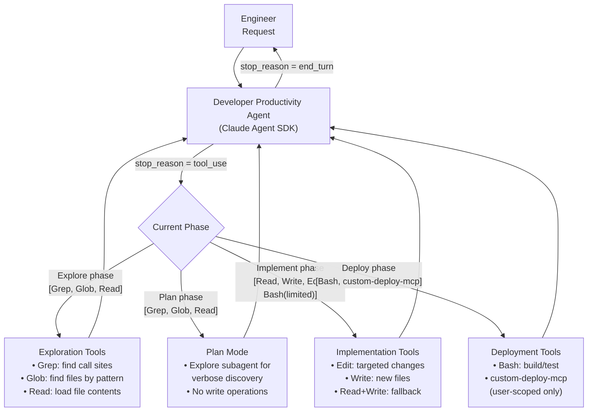

# Scenario 4: Developer Productivity Tools

> **Primary domains:** 2 (Tool Design & MCP Integration), 1 (Agentic Architecture & Orchestration), 3 (Claude Code Configuration & Workflows)
> **Task statements in play:** 2.5, 2.3, 2.4, 1.6, 1.1, 3.4, 5.4, 1.7
> **Exam weight:** This scenario is the bridge between Scenarios 1/3 (Agent SDK architecture) and Scenario 2 (Claude Code). It tests Agent SDK concepts through a coding-tool lens — particularly built-in tool selection and task-scoped tool profiles. Many questions test whether you can distinguish between "give agents more tools" vs. "give agents the right tools for the current phase."

---

## Table of Contents
1. [The Scenario](#1-the-scenario)
2. [System Architecture](#2-system-architecture)
3. [Role of Each Domain in This Scenario](#3-role-of-each-domain-in-this-scenario)
4. [What This Scenario Tests From You](#4-what-this-scenario-tests-from-you)
5. [Domain Task-Statement Walkthrough](#5-domain-task-statement-walkthrough)
6. [Scenario-Specific Traps](#6-scenario-specific-traps)
7. [Practice Question Bank](#7-practice-question-bank)
8. [Answer Key](#8-answer-key)
9. [Quick-Recall Cheat Sheet](#9-quick-recall-cheat-sheet)

---

## 1. The Scenario

You are building a **developer productivity agent** using the **Claude Agent SDK**. The agent helps engineers explore and understand unfamiliar codebases, generate boilerplate code, and automate repetitive development tasks. Your primary users are mid-level engineers who join large existing projects and need to onboard quickly.

**The agent's core capabilities:**

| Capability | Description |
|---|---|
| Codebase exploration | Navigate large legacy codebases, trace function call chains, map dependencies |
| Boilerplate generation | Generate code (new routes, data models, test stubs) following existing patterns |
| Test coverage | Identify untested code; generate targeted test cases for high-impact areas |
| Repetitive task automation | Batch rename, refactor patterns, update imports across multiple files |

**Built-in tools available:**

| Tool | Purpose |
|---|---|
| `Read` | Load full file contents |
| `Write` | Write or overwrite a file |
| `Edit` | Make targeted modifications using unique anchor text |
| `Bash` | Run shell commands |
| `Grep` | Search file contents for patterns |
| `Glob` | Find files matching name/path patterns |

**MCP servers configured:**

| Server | Scope | Purpose |
|---|---|---|
| `github-mcp` (community) | `.mcp.json` (project-scoped) | Issue lookup, PR status, code review API |
| `jira-mcp` (community) | `.mcp.json` (project-scoped) | Ticket management for task automation |
| `custom-deploy-mcp` (custom) | `~/.claude.json` (user-scoped) | Personal deployment workflow — not for team |

**The central design challenge:** The agent operates in distinct phases (explore → plan → implement → deploy) that require different tools. Giving the agent all tools at all phases creates tool misuse and safety risks. The exam tests whether you know how to design task-scoped tool profiles that change with phase, and which tools are right for which task.

---

## 2. System Architecture



**Key architectural facts to memorize:**
- Same Agent SDK loop mechanics as Scenario 1 — `stop_reason` drives loop control
- Tool profiles change by **phase** — not all tools available at all times
- `custom-deploy-mcp` is user-scoped (`~/.claude.json`) — should never appear in team's `.mcp.json`
- Dynamic adaptive decomposition for open-ended tasks (e.g., "add tests to legacy codebase")

---

## 3. Role of Each Domain in This Scenario

| Domain | Role | Tested? |
|---|---|---|
| **Domain 1 — Agentic Architecture** | **Secondary.** Same loop mechanics as Scenario 1. Dynamic adaptive decomposition for open-ended codebase tasks. Session management for multi-day investigations | Yes — 1.1, 1.6, 1.7 |
| **Domain 2 — Tool Design & MCP** | **Primary.** Owns built-in tool selection (Grep/Glob/Read/Write/Edit selection logic), task-scoped tool profiles, and MCP scoping (project vs user) | Yes — 2.5, 2.3, 2.4 |
| **Domain 3 — Claude Code Config** | **Secondary.** Plan-mode-vs-direct-execution judgment carries over even in Agent SDK context. Explore subagent pattern applies | Yes — 3.4 |
| **Domain 4 — Prompt Engineering** | **Not tested.** No structured-output/JSON extraction narrative | No |
| **Domain 5 — Context & Reliability** | **Secondary.** Long-session context degradation during codebase exploration; scratchpad files; crash recovery manifests | Yes — 5.4, 1.7 |

**The short version:** Domain 2 is primary — the exam is really testing built-in tool selection and MCP scoping here. Domain 1 appears in its "coding agent" form (same loop, adaptive decomposition). Domain 3 plan-mode judgment applies. Domain 5 covers what happens to context during long exploration sessions.

---

## 4. What This Scenario Tests From You

This scenario tests **precision in tool selection and tool scoping** — knowing not just which built-in tool to use, but which tools to remove from an agent's access at each phase, and how MCP scoping rules determine who sees what. Questions will present a specific failure (wrong tool, safety incident, shared personal server) and ask you to identify both the root cause and the minimal correct fix.

### Knowledge you must have cold

| Must know | Detail |
|---|---|
| Grep vs Glob | Grep = searches file *content* for patterns; Glob = finds files by *name/path pattern* |
| Edit fallback | Edit fails on non-unique anchor text → Read full file → modify → Write back |
| Task-scoped tool profiles | Explore phase: Grep, Glob, Read only; Implement phase: adds Write, Edit, limited Bash; Deploy phase: Bash + deploy MCP |
| MCP project vs user scope | `.mcp.json` = project-scoped, committed to git, all teammates; `~/.claude.json` = user-scoped, personal only |
| `${TOKEN}` expansion | Credentials in `.mcp.json` use env var expansion — never hardcode API keys |
| Community vs custom MCP | Standard integrations (GitHub, Jira) → community servers; team-specific workflows → custom |
| Dynamic adaptive decomposition | Open-ended unknown-scope task → map first, then adapt; NOT a fixed sequence |
| Explore subagent | Isolates verbose discovery output from main session |
| Scratchpad files | Key findings persisted to `*.md` files to survive context degradation |
| Crash recovery manifests | Structured state exports at checkpoints; coordinator loads on resume |

### Judgment calls the exam will ask you to make

| Exam question type | The judgment you must apply |
|---|---|
| "Find every file calling `authenticate()` — which tool?" | Grep (content search), not Glob (file name search) |
| "Agent ran `rm -rf` during implementation — prevent it" | Constrained Bash (allowed commands only) via tool profile, not a system-prompt instruction |
| "Personal deploy server shows up for all teammates — fix it" | Move from `.mcp.json` to `~/.claude.json` (user scope) |
| "Agent prefers built-in Grep over more capable MCP search tool — fix it" | Improve the MCP tool's description, not remove Grep |
| "'Add tests to legacy codebase' — how to decompose?" | Dynamic adaptive: map structure first, then create prioritized plan based on findings |
| "Edit fails — non-unique match — what next?" | Read + Write fallback (not retry Edit with same anchor) |

### Wrong-answer patterns to immediately recognize and reject

- Any answer that uses **Glob to find function call sites** — Glob matches file names, not content
- Any answer that puts a **personal/experimental MCP server in `.mcp.json`** — that makes it team-wide
- Any answer that gives the agent **all tools "just in case"** during a read-only exploration phase
- Any answer that uses **fixed sequential decomposition** for an open-ended task where scope is unknown upfront
- Any answer that builds a **custom MCP server for GitHub or Jira** — well-maintained community servers exist

---

## 5. Domain Task-Statement Walkthrough

### 2.5 — Built-in Tool Selection

**How it shows up here:**
The developer productivity agent constantly makes tool-selection decisions during codebase exploration. Using the wrong tool for a given task is the most common failure mode tested in this scenario.

**The critical distinction — Grep vs. Glob:**

| You need to... | Use | Why |
|---|---|---|
| Find every file that calls `authenticate()` | **Grep** | Searches file *contents* for the string |
| Find all test files (`*.test.ts`) | **Glob** | Matches file *names* by pattern |
| Find the definition of `UserProfile` class | **Grep** | Searches file *contents* for `class UserProfile` |
| Find all Terraform config files (`*.tf`) | **Glob** | Matches file *names* ending in `.tf` |

**The Edit vs. Read+Write decision:**

| Situation | Use |
|---|---|
| Target code block is **unique** in the file | `Edit` — efficient, targeted |
| Target code block is **repeated** (standard patterns, e.g., error handlers) | `Read` + modify + `Write` |
| Edit fails with "no unique match found" | Fall back to `Read` + `Write` |

**Incremental codebase exploration (the right pattern):**
```
Step 1: Grep for entry points (e.g., "export function", route definitions)
Step 2: Read the entry point files to understand the top-level flow
Step 3: Grep for imports and function names to trace dependencies
Step 4: Read only the dependent files (not all files upfront)
```

**Right vs. wrong:**

| ✅ Correct | ❌ Wrong |
|---|---|
| Grep to search for a function name across the codebase | Glob to search for a function name — Glob only matches file paths |
| Edit for targeted changes with unique anchor text | Write to make small changes — overwrites the entire file |
| Read + Write fallback when Edit can't find a unique match | Retry Edit with the same anchor text repeatedly |
| Start with Grep for entry points, then Read to follow imports | Read all 200 files upfront before starting any analysis |

---

### 2.3 — Task-Scoped Tool Profiles

**How it shows up here:**
The agent operates in distinct phases. During the **exploration phase**, the agent only needs to read — giving it Write, Edit, and Bash at this stage creates risk of accidental modification during discovery. During the **implementation phase**, Write and Edit are needed but deployment tools should not be accessible yet.

**Phase → Tool profile mapping:**

| Phase | Tools the agent should have | Tools to withhold |
|---|---|---|
| Explore | Grep, Glob, Read | Write, Edit, Bash, all MCP servers |
| Plan | Grep, Glob, Read | Write, Edit, Bash, all MCP servers |
| Implement | Read, Write, Edit, Bash (limited to test/build) | Deployment MCP servers |
| Deploy | Bash, custom-deploy-mcp | Write, Edit (don't allow code changes during deploy) |

**Right vs. wrong:**

| ✅ Correct | ❌ Wrong |
|---|---|
| Configure tool profile at task start: `allowedTools: ["Grep", "Glob", "Read"]` for exploration phase | Give agent access to all tools "just in case" — adds misuse risk and decision complexity |
| Restrict deploy tools to the deploy phase only | Allow `custom-deploy-mcp` during the exploration phase — agent might trigger deployments while just reading |
| Use constrained Bash variant (only `npm test`, `npm build`) during implementation | Unrestricted Bash during implementation — agent could run arbitrary destructive commands |

---

### 2.4 — MCP Server Integration

**How it shows up here:**
Two MCP scoping problems arise on this team:
1. A developer's personal `custom-deploy-mcp` server appears in the team's `.mcp.json` — now all engineers can accidentally trigger personal deployments
2. The agent prefers built-in tools over a more capable MCP search tool because the MCP tool's description is minimal

**Project scope vs. user scope:**

```
.mcp.json (project-scoped, committed to git)
  → Available to all team members
  → Use for: github-mcp, jira-mcp (shared team tools)
  → Credentials: ${GITHUB_TOKEN} env var expansion (never hardcode)

~/.claude.json (user-scoped, personal)
  → Available only to that developer
  → Use for: custom-deploy-mcp, experimental servers, personal workflows
```

**Right vs. wrong:**

| ✅ Correct | ❌ Wrong |
|---|---|
| `custom-deploy-mcp` in `~/.claude.json` (user-scoped) | `custom-deploy-mcp` in `.mcp.json` (project-scoped) — all teammates now have personal deploy access |
| `${GITHUB_TOKEN}` in `.mcp.json` for credential management | Hardcoded API keys in `.mcp.json` — credentials committed to git |
| Use community `github-mcp` and `jira-mcp` for standard integrations | Build custom MCP servers for GitHub and Jira — unnecessary |
| Enhance MCP tool descriptions to explain capabilities vs. built-in alternatives | Leave MCP descriptions minimal — agent defaults to Grep/Read it already "knows" |

---

### 1.6 — Dynamic Adaptive Decomposition

**How it shows up here:**
"Add comprehensive test coverage to this legacy codebase" is the canonical open-ended task for this scenario. The scope is unknown before starting — the agent cannot plan all the steps upfront because it doesn't yet know what modules exist, which have tests, and which are the highest-value targets.

**Dynamic adaptive vs. prompt chaining:**

| Approach | When to use | How it works |
|---|---|---|
| **Prompt chaining** (fixed sequential) | Steps are predictable upfront | Step 1 always leads to Step 2 always leads to Step 3 |
| **Dynamic adaptive decomposition** | Scope is unknown until you look | Step 1 = map structure; what you find determines Steps 2-N |

**Correct decomposition for "add tests to legacy codebase":**
```
Step 1: Map codebase structure (modules, files, existing test coverage)
  → DISCOVER: No tests exist for auth and payment modules
  → DISCOVER: 80% of business logic is in 3 files

Step 2: Identify high-impact, untested areas (guided by Step 1 findings)
  → Generated ADAPTIVELY based on Step 1 — not predetermined

Step 3: Prioritize based on dependencies discovered in Steps 1-2
  → auth must be tested before payment (payment depends on auth)

Step 4: Generate tests in dependency order (auth → payment → UI)
  → Adapts to discovered dependency graph
```

**Right vs. wrong:**

| ✅ Correct | ❌ Wrong |
|---|---|
| Map structure first → identify high-impact areas → create prioritized plan that adapts | Spawn 10 subagents immediately to write tests for random files in parallel |
| Adapt the test generation plan based on discovered dependencies (test auth before payment) | Assume a fixed sequence (file by file alphabetically) regardless of what's discovered |
| Generate subtasks based on what is discovered at each step | Specify all subtasks upfront in a fixed sequential plan |

---

### 1.1 — Agentic Loop

**How it shows up here:**
Same mechanics as Scenario 1, applied to a coding agent. The loop drives the exploration → implementation workflow. The agent must continue calling tools (Grep → Read → Edit) until the task is complete, terminating only on `stop_reason === "end_turn"`.

**Right vs. wrong:**

| ✅ Correct | ❌ Wrong |
|---|---|
| `stop_reason === "end_turn"` → task complete | Stop when assistant text says "I've refactored all the files" |
| Append tool results to history between iterations | Lose tool results between iterations — model can't reason about what it found |
| Continue iterating even if model prints a progress update mid-task | Treat a mid-task progress message as a completion signal |

---

### 3.4 — Plan Mode vs. Direct Execution

**How it shows up here:**
Even though this scenario uses the Agent SDK (not Claude Code directly), the plan-mode-vs-direct-execution judgment still applies: should the agent explore and plan before acting, or act directly?

**Applied to this scenario:**

| Task | Mode | Reason |
|---|---|---|
| "Explore the auth module and generate a dependency map" | Direct execution | Read-only task, clear scope — no destructive risk |
| "Add test coverage to the legacy payment module" | Plan mode + Explore subagent | Scope unknown, implementation risk, architectural decisions |
| "Rename `userId` to `user_id` in the user service" | Direct execution | Well-defined, single convention, no architecture decisions |
| "Restructure the API layer to support versioning" | Plan mode | Multiple valid approaches, many files, architectural implications |

**Right vs. wrong:**

| ✅ Correct | ❌ Wrong |
|---|---|
| Use plan mode for tasks with unknown scope, multiple valid approaches, or implementation risk | Use plan mode for every task — adds overhead where direct execution suffices |
| Use the Explore subagent for verbose codebase discovery phases — isolates output from main context | Run verbose discovery in the main agent session — fills context window before implementation |
| Use direct execution for single-file fixes, rename operations, clear-scope boilerplate | Use plan mode for a rename across 3 files — clear scope, no architectural decision |

---

### 5.4 — Context Management in Large Codebase Exploration

**How it shows up here:**
An engineer asks the agent to help onboard into a 200,000-line legacy codebase. After 4 hours of exploration, the agent starts describing "typical patterns" for user session management instead of the specific `SessionManager` class it actually found in the codebase — context has degraded.

**Right vs. wrong:**

| ✅ Correct | ❌ Wrong |
|---|---|
| Maintain a `codebase-findings.md` scratchpad that records key findings (class names, file paths, dependency relationships, gotchas) — reference for subsequent questions | Rely on in-context memory across a 4-hour session — context degrades progressively |
| Spawn subagents to investigate specific sub-questions ("find all test files in the repo", "trace the auth token refresh flow") — main agent preserves high-level understanding | Run the entire codebase exploration in the main session — verbose discovery fills context |
| Use `/compact` when context fills with verbose exploration output | Continue session until context is exhausted |
| Design crash recovery: each exploration subagent exports state to a manifest file; coordinator loads manifest on resume | Restart exploration from scratch after a crash |

---

### 1.7 — Session Management

**How it shows up here:**
The developer productivity agent is used across multi-day onboarding sessions. An engineer explores the codebase on Monday, then needs to continue on Tuesday. Mid-investigation, two valid implementation approaches emerge.

**Right vs. wrong:**

| ✅ Correct | ❌ Wrong |
|---|---|
| `--resume codebase-exploration` to continue Monday's session on Tuesday | Start fresh every morning — lose all accumulated context |
| `fork_session` to compare "extract auth to service" vs. "refactor in-place" from the same analysis | Start two separate sessions that redo all the codebase exploration |
| When files changed since last session: "Since Monday, these 5 files were updated: [list]. Please re-analyze those specifically." | Resume and assume prior tool results are still valid for changed files |
| Start fresh with a structured summary when stale tool results outnumber valid ones | Resume a stale session hoping the model can tell what's still accurate |

---

## 6. Scenario-Specific Traps

| Trap | Why it's wrong | Correct approach |
|---|---|---|
| Giving the agent all tools (Read, Write, Edit, Bash, Deploy) during the exploration phase | Agent may modify or deploy during what should be a read-only discovery | Task-scoped tool profiles: exploration phase = Grep, Glob, Read only |
| Using Glob to find all callers of a function | Glob matches file names/paths — it cannot search file contents | Grep — searches file content for patterns like function names |
| Applying fixed sequential decomposition to "add tests to the legacy codebase" | Scope is unknown upfront — fixed sequences miss entire modules discovered later | Dynamic adaptive decomposition: map → discover → prioritize → adapt |
| Building a custom MCP server for GitHub integration | Community MCP servers for standard integrations (GitHub, Jira) already exist and are well-maintained | Use community MCP server; reserve custom builds for team-specific workflows |
| Placing `custom-deploy-mcp` in `.mcp.json` instead of `~/.claude.json` | All team members gain access to one developer's personal deployment workflow | User-scoped personal MCP servers go in `~/.claude.json` |
| Relying on in-context memory for a 4-hour exploration session | Context degrades — model starts referencing "typical patterns" instead of specific discovered artifacts | Scratchpad files + subagent delegation for verbose discovery |
| Retrying Edit with the same anchor text when it fails | Edit fails due to non-unique text; retrying with the same anchor will fail again | Fall back to Read + Write: read full file, modify, write back |
| Using plan mode for a single-function bug fix with a clear stack trace | Plan mode overhead is unnecessary for well-scoped, single-file changes | Direct execution — scope is clear, no architecture decisions |

---

## 7. Practice Question Bank

> **Instructions:** All questions are anchored to Scenario 4. Read each in the context of the Agent SDK-based developer productivity tool described above.

---

### 2.5 — Built-in Tool Selection (3 questions)

**Q1.** An engineer asks the developer productivity agent to find every file in the repository that calls the function `validatePermissions()`. Which built-in tool should the agent use?

- A) Glob with pattern `**/*.ts` to find all TypeScript files, then check each
- B) Grep to search file contents across the repository for the string `validatePermissions`
- C) Read to load files one by one and scan for the function name
- D) Bash with `find . -name "*.ts"` to locate TypeScript files

---

**Q2.** The agent is updating an error-handling pattern in `api/src/middleware/errors.ts`. The standard `catch (error) { logger.error(error) }` pattern appears 12 times in the file. The agent tries to use Edit to update one specific occurrence but receives an error: "Could not find a unique match for the provided text." What is the correct next step?

- A) Retry the Edit call with more surrounding context until a unique match is found
- B) Use Bash with a sed command to perform a targeted replacement
- C) Use Read to load the full file, locate the specific occurrence, modify it in the agent's reasoning, then use Write to save the updated file
- D) Update all 12 occurrences simultaneously since they share the same pattern

---

**Q3.** The agent needs to explore a large TypeScript monorepo to understand its architecture before generating boilerplate code. Which approach correctly builds codebase understanding incrementally?

- A) Read all 300 TypeScript files in the repository before starting any analysis
- B) Use Grep to find entry points (exported functions, route definitions), Read those files to understand the flow, then Grep for imports to trace dependencies incrementally
- C) Use Glob to find all `index.ts` files, then read every file in the repository
- D) Ask the engineer to provide a codebase summary before starting

---

### 2.3 — Task-Scoped Tool Profiles (3 questions)

**Q4.** The developer productivity agent is in the "explore" phase, mapping the architecture of a legacy payment processing module before planning any changes. Which tool profile is correct for this phase?

- A) All tools: Read, Write, Edit, Bash, Grep, Glob, github-mcp, jira-mcp, custom-deploy-mcp
- B) Read-only subset: Grep, Glob, Read — no write operations, no deployment tools
- C) Read and Write only — the agent may need to take notes while exploring
- D) Grep and Glob only — the agent should not read file contents during exploration

---

**Q5.** During the implementation phase, the agent is writing new API route handlers. A teammate argues the agent should also have access to the deployment MCP server during implementation so it can deploy immediately after writing code. Why is this problematic?

- A) Deployment MCP servers are too slow to use during the implementation phase
- B) Giving the agent deploy access during implementation means it might trigger a production deployment while still writing and testing code — a task-scoped tool profile removes this risk
- C) The MCP server is user-scoped and cannot be used during implementation phases
- D) Deployment should always be a separate manual step, regardless of tool access

---

**Q6.** An engineer configures the agent with Bash access during the implementation phase with the full shell available. The agent later runs `rm -rf node_modules/` while trying to "clean up the project." Which design decision would have prevented this?

- A) Add a system prompt instruction: "Never run rm -rf commands"
- B) Use a constrained Bash variant that allows only `npm test`, `npm build`, and `git status` during the implementation phase — the agent cannot execute destructive shell operations it doesn't have access to
- C) Run the implementation phase in a sandboxed environment that prevents file deletion
- D) Monitor the agent's Bash calls and intervene if a destructive command is detected

---

### 2.4 — MCP Integration (3 questions)

**Q7.** A developer has a personal `custom-deploy-mcp` server for their private staging environment. They accidentally added it to the project's `.mcp.json` file. What is the consequence?

- A) The MCP server will only activate for that developer since it detects their credentials
- B) All team members now have access to the custom deploy workflow — any engineer running the agent could trigger the developer's personal staging deployments
- C) The MCP server will be ignored since `.mcp.json` only recognizes official community servers
- D) The custom server will conflict with the existing `github-mcp` and fail to load

---

**Q8.** The developer productivity agent consistently uses the built-in Grep tool for code search instead of the team's MCP-based semantic code search tool, which provides better contextual results. The MCP tool is correctly configured in `.mcp.json`. What is the most effective fix?

- A) Remove the built-in Grep tool from the agent's `allowedTools` so it cannot use it
- B) Add a system prompt instruction: "Always prefer the MCP semantic search tool over Grep"
- C) Enhance the MCP semantic search tool's description to explain its capabilities, expected inputs, output format, and why it should be preferred for semantic queries over Grep's exact-match search
- D) Give the MCP tool the same name as Grep so the agent uses it interchangeably

---

**Q9.** The team uses GitHub and Jira for project management. An engineer proposes building a custom MCP server to integrate both tools because "we'll have more control." What is the correct approach?

- A) Build a custom server for GitHub (since it's the primary tool) and use the community Jira server
- B) Build custom servers for both — control over the implementation is always worth the investment
- C) Use existing community MCP servers for both GitHub and Jira; reserve custom builds for the team's specific deployment workflow that has no community solution
- D) Avoid MCP integration entirely and use Bash commands to interact with the APIs directly

---

### 1.6 — Dynamic Adaptive Decomposition (3 questions)

**Q10.** An engineer asks the developer productivity agent: "Add comprehensive test coverage to our legacy payment processing module." The module has never been tested and its internal structure is unknown. What should the agent do first?

- A) Immediately generate test files for every function found in the module's directory
- B) Ask the engineer to provide a list of functions to test before starting
- C) Map the module's structure first — identify components, dependencies, and untested paths — then create a prioritized test plan that adapts based on what is discovered
- D) Generate a test template file that the engineer can fill in manually

---

**Q11.** After mapping the legacy payment module, the agent discovers that `AuthService` must be tested before `PaymentProcessor` (because `PaymentProcessor` depends on `AuthService`). This dependency was not known before mapping. This demonstrates why:

- A) The agent should have asked the engineer about dependencies before starting
- B) Fixed sequential decomposition (alphabetical file order) would have tested `PaymentProcessor` before `AuthService`, creating tests that fail due to missing auth dependencies — dynamic adaptive decomposition discovers this dependency and reorders accordingly
- C) All tests should be generated in parallel to avoid this dependency ordering problem
- D) The mapping phase should be skipped to save time when dependencies are obvious

---

**Q12.** An engineer specifies: "Generate tests for these 5 functions in this order: [list]." This is an example of:

- A) Dynamic adaptive decomposition — the engineer is guiding the discovery
- B) Prompt chaining with a fixed predetermined sequence — the steps are known upfront and the engineer is specifying them
- C) Over-specification — the engineer should let the agent determine the order
- D) An invalid task structure that the agent cannot execute

---

### 1.1 — Agentic Loop (2 questions)

**Q13.** The developer productivity agent is tracing a complex call chain through 8 files. After reading the 6th file, the agent's response includes "I believe I've traced the complete call chain to the authentication service." The agentic loop should:

- A) Terminate — the model has indicated the task is complete
- B) Continue — only terminate when `stop_reason === "end_turn"`, not when the model prints a progress or completion statement
- C) Pause and ask the engineer to confirm whether the trace is complete
- D) Terminate and start a new session for any follow-up investigation

---

**Q14.** The developer productivity agent calls `Grep`, receives results, calls `Read` on 3 matching files, then calls `Edit` to make a change. After the `Edit` call, `stop_reason` is `"tool_use"` again. The correct behavior is:

- A) Terminate — the Edit completed the task
- B) Check whether the edit was correct before continuing
- C) Continue the loop — execute the next tool call indicated by the model and append results to history
- D) Ask the engineer whether to continue

---

### 3.4 — Plan Mode vs. Direct Execution (2 questions)

**Q15.** An engineer wants to restructure the API layer to support versioning (`/v1/`, `/v2/`). This affects route definitions, middleware configuration, request handlers, and integration tests — approximately 35 files. Which approach is correct?

- A) Direct execution — the agent can figure out the right approach as it goes
- B) Plan mode — explore the current API structure, identify all affected files, design the versioning approach, review the plan, then execute
- C) Plan mode for the route definitions; direct execution for the test updates
- D) Direct execution with a rollback strategy in case it goes wrong

---

**Q16.** The agent is asked to explore the auth module to answer the question: "What happens to a user session when their JWT expires?" This is a read-only investigation. Which mode is appropriate?

- A) Plan mode — auth is sensitive and exploration should be planned carefully
- B) Direct execution with the Explore subagent to isolate verbose exploration output
- C) Plan mode — any auth-related task requires careful planning
- D) Direct execution in the main session, reading all auth files sequentially

---

### 5.4 — Context in Codebase Exploration (2 questions)

**Q17.** After 5 hours of helping an engineer understand a legacy codebase, the developer productivity agent begins responding with generic descriptions like "the service layer typically handles business logic" instead of referencing the specific `BusinessRuleEngine` class it found in hour 2. What is the most effective structural fix?

- A) Start fresh sessions every 2 hours to prevent context degradation
- B) Have the agent maintain a `codebase-findings.md` scratchpad that records specific class names, file paths, and key relationships — reference this file in subsequent questions rather than relying on in-context memory
- C) Increase the agent's context window size to retain more information
- D) Ask the engineer to re-specify the context at the start of each question

---

**Q18.** The agent is performing a multi-day onboarding exploration of a 500,000-line codebase. The exploration crashes 6 hours in due to a network timeout. To design crash recovery, the agent should:

- A) Restart the exploration from scratch — crash recovery is too complex to implement
- B) Save the full conversation history to disk and reload it on resume
- C) Export structured agent state to a manifest file at regular checkpoints (key findings, files explored, current position in the task queue); the coordinator loads this manifest on resume and injects it into agent prompts
- D) Use `--resume` to continue from the last named session automatically

---

### 1.7 — Session Management (2 questions)

**Q19.** A developer spent Monday mapping the authentication module's dependencies (saved as session `auth-map`). On Tuesday, they want to continue from where they left off, but 3 files were modified over the weekend. What is the correct approach?

- A) `--resume auth-map` and hope the model notices the files are stale
- B) `--resume auth-map` and explicitly tell the agent: "The following 3 files have changed since our last session: [list]. Please re-analyze those specifically."
- C) Start a fresh session with a complete description of everything discovered on Monday
- D) Use `fork_session` to create a branch that includes the file changes

---

**Q20.** An engineer has finished mapping the legacy payment module and now wants to explore two different refactoring strategies: (A) extract to a microservice and (B) modernize in-place. Both strategies should start from the completed mapping. The correct approach is:

- A) Explore strategy A first; if it looks good, commit to it without exploring B
- B) Start two completely separate exploration sessions for A and B, each remapping the payment module from scratch
- C) Use `fork_session` from the completed mapping baseline — two independent branches each explore a different refactoring strategy
- D) Write up both strategies in a plan document and have a senior engineer decide

---

## 8. Answer Key

**Q1: B**
Grep searches file contents for a pattern. To find every call site of `validatePermissions()`, you need to search the content of files — Grep is the correct tool. Glob (A) matches file names/paths and cannot search content. Reading files one by one (C) is inefficient. Bash find (D) also only finds files by name.

**Q2: C**
When Edit fails due to a non-unique match, the correct fallback is Read + Write: load the full file, locate the specific occurrence in the agent's reasoning, modify it, and write the updated file back. Retrying Edit (A) with the same pattern will fail again for the same reason. Bash sed (B) works but is not the idiomatic fallback. Updating all 12 occurrences (D) was not the task.

**Q3: B**
Incremental exploration: Grep for entry points (fast, targeted) → Read entry point files → Grep for imports → Read only the relevant dependent files. This builds understanding without loading every file into context. Reading all 300 files upfront (A) fills the context window immediately.

**Q4: B**
The exploration phase is read-only: Grep, Glob, and Read are the correct tools. No write operations are needed for discovery. No deployment tools should be accessible during a read-only phase. "Taking notes" (C) in the context of exploration can be done in a scratchpad file using Write, but the question asks about the phase profile — exploration is primarily read-only.

**Q5: B**
Having deploy access during implementation creates a window where the agent could deploy partially written, untested code. Task-scoped tool profiles prevent this by making deployment tools unavailable until the deploy phase is explicitly entered.

**Q6: B**
A constrained Bash variant that only allows specific safe commands (npm test, npm build, git status) is the only deterministic fix. System prompt instructions (A) are probabilistic — the model might still run the command. Sandboxing (C) is an external safeguard, not an agent design decision. Monitoring and intervening (D) is reactive, not preventive.

**Q7: B**
Project-scoped `.mcp.json` is committed to git and loaded for all team members. Any MCP server in this file is available to every engineer on the team. Personal/experimental servers must go in `~/.claude.json` (user-scoped). The MCP server doesn't automatically detect credentials (A) or conflict with other servers (D).

**Q8: C**
When agents prefer built-in tools over MCP tools, the fix is to improve the MCP tool's description to explain its superior capabilities for specific use cases. Removing Grep (A) breaks legitimate exact-match use cases. System prompt instructions (B) are keyword-sensitive and probabilistic. Renaming the MCP tool to "Grep" (D) creates confusion and is not how tool selection works.

**Q9: C**
Community MCP servers for standard integrations (GitHub, Jira, Slack) are well-maintained and save development time. Custom servers should be reserved for unique, team-specific workflows that don't have community solutions — like the custom deployment workflow.

**Q10: C**
The scope of "comprehensive test coverage" is completely unknown before mapping the codebase. Dynamic adaptive decomposition starts with mapping: discover what exists, what's tested, what's critical — then create a prioritized plan based on findings. Spawning subagents immediately (A) creates tests without understanding dependencies or priorities.

**Q11: B**
Fixed sequential decomposition (alphabetical or arbitrary ordering) would have generated `PaymentProcessor` tests before `AuthService` tests, causing them to fail because `PaymentProcessor` depends on `AuthService`. Dynamic adaptive decomposition discovered the dependency relationship during the mapping phase and reorders accordingly.

**Q12: B**
When the engineer specifies exactly which functions to test in which order, the steps are predetermined — this is prompt chaining (fixed sequential pipeline). Dynamic adaptive decomposition is when the agent discovers the steps based on what it finds during exploration.

**Q13: B**
The agentic loop terminates only on `stop_reason === "end_turn"`. A mid-loop statement from the model about having traced the call chain is conversational output during the reasoning process, not a completion signal. The model may still have tool calls pending.

**Q14: C**
`stop_reason === "tool_use"` means the model wants to call another tool. The loop continues: execute the next tool call, append the result to conversation history, and call the API again. The task is not complete until `stop_reason === "end_turn"`.

**Q15: B**
A 35-file API versioning restructure has architectural implications (URL structure design, backward compatibility, middleware ordering) and multiple valid implementation approaches. Plan mode is correct: explore the current structure, design the approach, review the plan, then execute. Direct execution (A, C) risks an inconsistent implementation across 35 files.

**Q16: B**
A read-only investigation has clear scope — it's not architecture decision territory. However, the exploration of auth files may produce verbose intermediate output. Direct execution is appropriate, but using the Explore subagent isolates that verbose output from the main session. Direct execution in the main session (D) would fill the context with raw file contents.

**Q17: B**
A scratchpad file recording specific findings (class names, file locations, relationships) persists accurately across context boundaries and session length. The model can reference it explicitly regardless of how much time has passed or how full the context is. Fresh sessions every 2 hours (A) lose the accumulated context. Increasing context size (C) delays degradation but doesn't fix it.

**Q18: C**
Structured state manifests exported at checkpoints are the correct crash recovery design: each agent knows what it has explored, what it found, and where it was when it crashed. On resume, the coordinator loads the manifest and injects state into agent prompts. Full conversation history (B) is too verbose and doesn't structure the state for injection. `--resume` (D) resumes a named session but doesn't handle the crash recovery state restoration.

**Q19: B**
Resume the named session (to retain accumulated context) but explicitly tell the agent which files changed and ask for targeted re-analysis of only those files. This preserves Monday's valid findings while refreshing the stale ones. Option A silently accepts stale results. Option C loses all of Monday's work. `fork_session` (D) is for divergent exploration, not for incorporating file changes.

**Q20: C**
`fork_session` from the completed mapping creates two independent branches that each start from the shared understanding of the payment module. Neither branch needs to redo the mapping work. Starting separate sessions (B) means each branch independently remaps the module — wasted effort.

---

## 9. Quick-Recall Cheat Sheet

**Built-in tool selection (2.5)**
- Grep = search file *content* (callers, class definitions, patterns)
- Glob = find files by *name/path pattern* (*.test.ts, terraform/*.tf)
- Edit = targeted change with unique anchor text; fails → Read + Write fallback
- Never: Read all files upfront; always: Grep entry points first, Read to follow

**Task-scoped tool profiles (2.3)**
- Explore phase: Grep, Glob, Read — nothing else
- Implement phase: Read, Write, Edit, limited Bash — no deploy tools
- Deploy phase: Bash, deploy MCP — no Write/Edit (code is frozen)
- Over-provisioning = degraded selection + safety risks

**MCP scoping (2.4)**
- `.mcp.json` = project-scoped = all teammates = committed to git
- `~/.claude.json` = user-scoped = personal only
- Credentials: `${TOKEN}` env var expansion — never hardcode
- Standard integrations (GitHub, Jira) → community servers, not custom

**Dynamic adaptive decomposition (1.6)**
- Open-ended unknown-scope task → adaptive (discover → adapt → plan)
- Predictable steps known upfront → prompt chaining (fixed sequence)
- "Add tests to legacy codebase" = adaptive: map first, then prioritize

**Agentic loop (1.1)**
- Terminate on `stop_reason === "end_turn"` only
- Model's mid-loop text is not a completion signal

**Plan mode vs. direct execution (3.4)**
- 35+ files, architecture decisions → plan mode
- Single-file fix, clear stack trace → direct execution
- Explore subagent = verbose discovery output isolated from main session

**Context in exploration (5.4)**
- Scratchpad file = findings persist across context boundaries
- Subagents for verbose sub-tasks = main session stays clean
- Crash recovery = structured manifest exported at checkpoints

**Session management (1.7)**
- `--resume <name>` = continue named session
- `fork_session` = independent branches from shared baseline
- Files changed → explicitly tell the agent; don't silently resume with stale results
