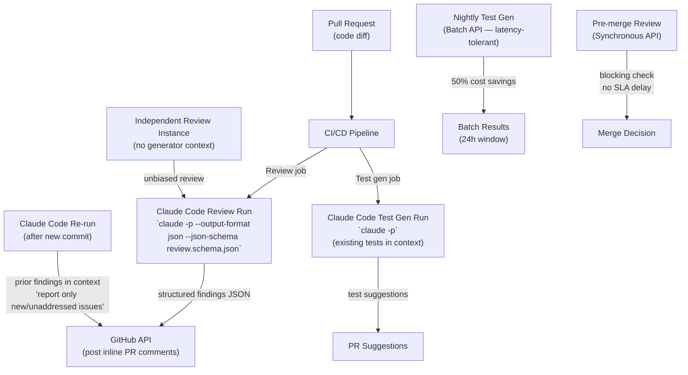

# Scenario 5: Claude Code for CI/CD

> **Primary domains:** 3 (Claude Code Configuration & Workflows), 4 (Prompt Engineering & Structured Output)
> **Task statements in play:** 3.6, 3.1, 4.1, 4.2, 4.3, 4.6
> **Exam weight:** The most concentrated scenario — only 2 primary domains, 6 task statements. Almost every question tests a specific technical flag, pattern, or design principle. No ambiguity about which approach is correct — this scenario is about knowing the exact CLI flags and design rules.

---

## Table of Contents
1. [The Scenario](#1-the-scenario)
2. [System Architecture](#2-system-architecture)
3. [Role of Each Domain in This Scenario](#3-role-of-each-domain-in-this-scenario)
4. [What This Scenario Tests From You](#4-what-this-scenario-tests-from-you)
5. [Domain Task-Statement Walkthrough](#5-domain-task-statement-walkthrough)
6. [Scenario-Specific Traps](#6-scenario-specific-traps)
7. [Practice Question Bank](#7-practice-question-bank)
8. [Answer Key](#8-answer-key)
9. [Quick-Recall Cheat Sheet](#9-quick-recall-cheat-sheet)

---

## 1. The Scenario

You are integrating **Claude Code** into your **CI/CD pipeline** at a company with a high-velocity engineering team. The pipeline runs on every pull request and has two Claude Code-powered jobs:

**Job 1 — Automated Code Review**
- Analyzes the PR diff for bugs, security issues, and style violations
- Posts findings as inline comments on the PR via the GitHub API
- Must not re-post comments that were already addressed in a previous commit
- False positives erode developer trust — precision matters more than recall

**Job 2 — Test Generation**
- Generates test cases for new or modified code
- Posts generated tests as suggestions in the PR
- Should not suggest tests that already exist in the test suite
- Runs nightly as well as on PRs (two different latency requirements)

**System constraints:**
- Pipeline runs **non-interactively** — no human to respond to Claude Code's clarifying questions
- Code review findings must be **machine-parseable** for automated GitHub comment posting
- The same Claude Code instance that writes code **cannot effectively review its own output**
- Large PRs with 30+ modified files need **per-file analysis + cross-file integration pass**

**The central design challenge:** Standard Claude Code is interactive — it waits for human input, returns free-form text, and operates with access to the full context of its current session. CI/CD breaks all three assumptions. The exam tests whether you know how to make Claude Code headless, structured, and unbiased.

---

## 2. System Architecture



**Key facts to memorize:**
- `-p` / `--print` = headless / non-interactive mode (no hanging for input)
- `--output-format json` + `--json-schema` = structured machine-parseable output
- Nightly test gen = Batch API; pre-merge review = Synchronous API
- Independent review instance = NO shared context with the code generator
- CLAUDE.md = source of testing standards, fixture conventions, review criteria for the pipeline

---

## 3. Role of Each Domain in This Scenario

| Domain | Role | Tested? |
|---|---|---|
| **Domain 1 — Agentic Architecture** | **Not tested.** No agentic loop or multi-agent orchestration in this scenario | No |
| **Domain 2 — Tool Design & MCP** | **Not tested.** No MCP servers or tool-design narrative | No |
| **Domain 3 — Claude Code Config** | **Primary.** Owns headless invocation (`-p`), structured output flags, CLAUDE.md as pipeline context, session isolation for unbiased review | Yes — 3.6, 3.1 |
| **Domain 4 — Prompt Engineering** | **Primary.** Owns precision/false-positive reduction, few-shot consistency for severity labels, structured output via tool_use + JSON schema, and multi-pass review for large PRs | Yes — 4.1, 4.2, 4.3, 4.6 |
| **Domain 5 — Context & Reliability** | **Not tested.** No long-conversation or multi-agent context management narrative | No |

**The short version:** This scenario is purely Domain 3 + Domain 4. Domain 3 handles the operational mechanics of running Claude Code in a pipeline. Domain 4 handles the quality of what Claude Code produces: precision, consistency, structured output format, and review architecture. Domains 1, 2, and 5 have no direct role here.

---

## 4. What This Scenario Tests From You

This scenario tests **exact technical knowledge of specific flags, API choices, and review architecture patterns**. There is very little ambiguity — the exam is checking whether you know precise implementation details: the exact CLI flag for non-interactive mode, the exact API for overnight batch jobs, the exact reason self-review fails, and the exact alternative. Vague conceptual understanding is not enough here; you need to know the specific answers.

### Knowledge you must have cold

| Must know | Detail |
|---|---|
| `-p` / `--print` flag | Enables non-interactive / headless mode — required for all CI invocations |
| `--output-format json --json-schema` | Produces machine-parseable structured output; use together |
| Batch API vs Synchronous API | Batch = 50% savings, ≤24h window, no SLA; Synchronous = blocking, immediate, SLA-appropriate |
| Self-review bias | Same session that generated code cannot effectively review it — reasoning context biases review |
| Independent review instance | Fresh session with no generation context — sees code without prior reasoning commitment |
| Per-file + cross-file passes | Large PRs: local analysis per file, then separate integration pass for cross-file consistency |
| `tool_choice: "any"` | Forces tool use; model chooses which tool — use when multiple schemas exist |
| `tool_choice: {"type":"tool","name":"X"}` | Forces the model to call exactly this tool — use for single known schema |
| Explicit categorical criteria | Define exactly which categories to flag / skip; never use "be conservative" or "high-confidence only" |
| Duplicate comment prevention | Include prior findings in context; instruct "only new/unaddressed issues" |

### Judgment calls the exam will ask you to make

| Exam question type | The judgment you must apply |
|---|---|
| "Pipeline hangs at Claude Code step — fix it" | Missing `-p` flag — Claude Code waiting for interactive input |
| "Findings posted as duplicate comments after every commit — fix it" | Include prior findings in context; instruct to report only new/unaddressed issues |
| "False positive rate on style category is high — fix it" | Define explicit category criteria (what to flag vs. skip); don't say "be conservative" |
| "Severity labels are inconsistent run to run — fix it" | Add few-shot examples with concrete code per severity level |
| "Code generator reviews its own PR and misses subtle bugs — fix it" | Independent review instance with no generation context |
| "35-file PR produces contradictory findings — fix it" | Per-file local passes + separate cross-file integration pass |
| "Nightly test gen vs. pre-merge blocking check — which API?" | Nightly = Batch API; pre-merge blocking = Synchronous API — never swap these |

### Wrong-answer patterns to immediately recognize and reject

- Any answer that uses the **Batch API for a blocking pre-merge check** — Batch has no latency SLA; a merge check cannot wait up to 24 hours
- Any answer that uses **"be conservative," "high-confidence only," or "be careful"** to reduce false positives — these are subjective and produce inconsistent results
- Any answer that has **the same session that generated code reviewing it** — self-review bias means it won't question its own decisions
- Any answer that uses **`tool_choice: "auto"` for guaranteed structured output** — auto allows the model to skip tool use and return text

---

## 5. Domain Task-Statement Walkthrough

### 3.6 — CI/CD Integration

**How it shows up here:**
Running Claude Code in a CI pipeline is fundamentally different from running it interactively. Four specific technical decisions must be correct:

**1. Non-interactive mode — the `-p` flag:**
```bash
# Interactive mode (DO NOT use in CI):
claude "Review this code"
# → Waits for human input → Pipeline hangs indefinitely

# Non-interactive / headless mode (correct):
claude -p "Review this code"
# → Prints result and exits → Pipeline continues
```

**2. Structured output flags:**
```bash
# Free-form text (cannot be parsed for GitHub API):
claude -p "Review this PR diff"
# → Returns: "I found a few issues. The null check on line 47..."

# Structured JSON with schema enforcement (correct for automated posting):
claude -p --output-format json --json-schema review_schema.json "Review this PR diff"
# → Returns: [{"file": "auth.ts", "line": 47, "severity": "high", "issue": "...", "fix": "..."}]
```

**3. Avoiding duplicate comments on re-runs:**
```
Problem: Developer pushes a new commit after addressing 3 of 5 findings.
         Claude Code re-runs and posts all 5 findings again — 3 are duplicates.

Fix: Include prior findings in context:
     "Here are the findings from the previous review run: [list]
      Report ONLY findings that are NEW or still unaddressed."
```

**4. Avoiding duplicate test suggestions:**
```
Problem: Test generation suggests tests that already exist in the test suite.

Fix: Provide the existing test file(s) in context:
     "Here is the current test file for this module: [content]
      Generate only tests for cases not already covered."
```

**Right vs. wrong:**

| ✅ Correct | ❌ Wrong |
|---|---|
| `claude -p "..."` for all CI invocations | `claude "..."` without `-p` — pipeline hangs waiting for input |
| `--output-format json --json-schema <schema>` for machine-parseable review findings | Parsing free-form Claude Code text output with regex |
| Include prior findings in context for re-runs; instruct to report only new issues | Re-run without prior context — all findings posted again as duplicate comments |
| Provide existing test files in context for test generation | Generate tests without existing test context — duplicates existing coverage |

---

### 3.1 — CLAUDE.md as Pipeline Context

**How it shows up here:**
When Claude Code runs in a CI pipeline, it has no interactive session where a developer could explain the codebase's testing philosophy or review standards. CLAUDE.md is the mechanism for injecting this context.

**What belongs in CI-facing CLAUDE.md:**

| Information | Why it matters for CI |
|---|---|
| Testing standards (assertion styles, fixture conventions, mocking patterns) | Test generation produces tests that match the team's style, not generic templates |
| Available fixtures and test utilities | Claude Code uses existing fixtures instead of hardcoding test data |
| Review criteria (what to flag vs. skip) | Review job has consistent, well-calibrated criteria independent of prompt verbosity |
| Code generation standards | Boilerplate generation follows existing patterns |

**Right vs. wrong:**

| ✅ Correct | ❌ Wrong |
|---|---|
| Document testing standards, fixture usage, available test helpers in project-level `CLAUDE.md` | Leave CLAUDE.md empty — Claude Code generates tests using generic patterns that don't match the team's style |
| Include a list of valuable test criteria (edge cases to always cover, specific failure modes) | Rely on the model's default test generation judgment without project context |
| Document review criteria explicitly in CLAUDE.md (e.g., "Flag null pointer risks in async functions; do not flag minor style inconsistencies") | Inject review criteria only in the CI prompt — not version-controlled, harder to maintain |

---

### 4.1 — Explicit Criteria to Reduce False Positives

**How it shows up here:**
The code review job is producing too many false positives in the "style" category — developers are dismissing real bugs because they've lost trust due to noise. The challenge is reducing false positives without missing real issues.

**Why vague instructions fail:**

| Vague instruction | Why it fails |
|---|---|
| "Be conservative — only report high-confidence findings" | "High-confidence" is subjective and inconsistent between runs |
| "Only report issues you're sure about" | Model's self-assessed confidence doesn't correlate with actual false positive rate |
| "Avoid minor issues" | "Minor" is undefined — different runs classify the same issue differently |

**Explicit categorical criteria (the correct approach):**

```
Flag these categories:
- Bugs: logic errors, null pointer risks, off-by-one errors
- Security: injection risks, exposed credentials, authentication bypasses
- Data loss risks: irreversible operations without safeguards

Do NOT flag these categories:
- Style inconsistencies with local conventions (unless they create bugs)
- Minor naming preference differences
- Performance micro-optimizations without measurement evidence
- Comments that are slightly imprecise but not misleading
```

**Right vs. wrong:**

| ✅ Correct | ❌ Wrong |
|---|---|
| Define which categories to report and which to skip with specific named conditions | "Be conservative" or "only flag high-confidence issues" — subjective, inconsistent |
| Temporarily disable a high-false-positive category entirely while improving its criteria | Lower overall thresholds to compensate for one noisy category — increases false negatives in other categories |
| Add concrete code examples defining each severity level | Define severity in prose only — different runs produce different classifications |

---

### 4.2 — Few-Shot Prompting for Consistency

**How it shows up here:**
Two consistency problems arise in this pipeline:
1. Severity labels are inconsistent — the same issue is classified as "high" in one run and "medium" in another
2. Branch-coverage gaps are ambiguous — the reviewer inconsistently flags partial branch coverage

**Few-shot examples for severity consistency:**

```
Here are examples of correctly classified findings:

SEVERITY: HIGH
Code: await db.query(userInput)
Issue: SQL injection — user input directly used in database query
Fix: Use parameterized queries: db.query("SELECT * FROM users WHERE id = ?", [userId])

SEVERITY: MEDIUM
Code: if (response.data.user.profile.name) { ... }
Issue: Deep property access without null checks — will throw if any intermediate is null
Fix: Use optional chaining: if (response.data?.user?.profile?.name) { ... }

SEVERITY: LOW
Code: const x = await fetchData()
Issue: Missing error handling for the await call
Fix: Wrap in try/catch or add .catch() — impact limited to this component
```

**Right vs. wrong:**

| ✅ Correct | ❌ Wrong |
|---|---|
| 2-4 targeted few-shot examples for each severity level with concrete code showing reasoning | Prose description of severity levels without code examples — inconsistent classification |
| Few-shot examples for ambiguous cases (branch coverage gaps) showing the reasoning for the classification | No examples for ambiguous cases — model generalizes poorly to edge cases |
| Examples that show WHY one issue is HIGH vs. MEDIUM, not just the labels | Examples that only show the labels without reasoning — model cannot generalize |

---

### 4.3 — Structured Output via Tool Use and JSON Schema

**How it shows up here:**
The CI pipeline needs to automatically post review findings as inline GitHub comments. Free-form text cannot be parsed reliably. JSON schema enforcement via `tool_use` guarantees structure.

**Why "please respond in JSON" fails:**
```
Prompt: "Review the code and respond in JSON format"
Response: "Here are the findings:

```json
[{"file": "auth.ts", "line": 47, ...}]
```

Oh wait, I also noticed..." ← breaks JSON parsing
```

**The correct approach — `tool_use` with JSON schema:**
```json
{
  "tools": [{
    "name": "report_findings",
    "description": "Report code review findings",
    "input_schema": {
      "type": "object",
      "properties": {
        "findings": {
          "type": "array",
          "items": {
            "type": "object",
            "properties": {
              "file": { "type": "string" },
              "line": { "type": "integer" },
              "severity": { "type": "string", "enum": ["high", "medium", "low"] },
              "category": { "type": "string" },
              "issue": { "type": "string" },
              "suggested_fix": { "type": ["string", "null"] }
            },
            "required": ["file", "line", "severity", "category", "issue"]
          }
        }
      }
    }
  }],
  "tool_choice": { "type": "tool", "name": "report_findings" }
}
```

**`tool_choice` options:**

| Setting | Behavior | Use when |
|---|---|---|
| `"auto"` | Model may call a tool OR return text | Never for guaranteed structured output |
| `"any"` | Model must call a tool; can choose which | Multiple extraction schemas; document type unknown |
| `{"type": "tool", "name": "X"}` | Model MUST call tool X specifically | One specific extraction schema; guaranteed format |

**Right vs. wrong:**

| ✅ Correct | ❌ Wrong |
|---|---|
| `tool_use` with JSON schema + `tool_choice: {"type": "tool", "name": "report_findings"}` | "Please respond in JSON format" — probabilistic, ~2-5% syntax error rate |
| `tool_choice: "any"` when the document type is unknown and multiple schemas might apply | `tool_choice: "auto"` for structured output — model may return text instead |
| Mark `suggested_fix` as nullable (`"type": ["string", "null"]`) — not all issues have an obvious fix | Mark all fields as required — forces the model to invent values for absent information |

---

### 4.6 — Multi-Instance and Multi-Pass Review

**How it shows up here:**
Two review quality problems arise:
1. The same Claude Code session that generated the code reviews the PR diff — it misses issues because its prior reasoning context biases review
2. A 35-file PR gets contradictory findings across files — some cross-file data flow issues are missed

**Self-review limitation:**
```
Code generation session context:
  "I implemented the JWT validation this way because... 
   The tradeoff is X, which I considered acceptable..."

Same session reviewing its own code:
  → Will not question the JWT implementation decision it just made
  → Reasoning context from generation biases the review
  → Misses subtle issues a fresh perspective would catch
```

**Independent review instance:**
```
New session (no generation context):
  → Sees the code as a reviewer would see it
  → Has no prior commitment to the implementation decisions
  → More likely to catch subtle bugs, security issues, questionable design choices
```

**Multi-pass review for large PRs:**

```
Problem: One Claude Code run reviewing all 35 modified files
  → Middle-file findings underprocessed ("lost in the middle" effect)
  → Cross-file issues (data flows between modified files) may be missed
  → Findings in different files may contradict each other

Solution: Two-pass review
  Pass 1: Per-file local analysis — focus on each file independently
           (Run as separate Claude Code invocations per file, or per file-batch)
  Pass 2: Cross-file integration pass — focus on data flow, API contracts,
           consistency across all modified files
           (Run with summaries from Pass 1 as input)
```

**Right vs. wrong:**

| ✅ Correct | ❌ Wrong |
|---|---|
| Independent Claude Code instance (new session) reviews the PR diff | Same Claude Code session that generated the code reviews its own output |
| Instruct review instance to run without generation context | Add "review your code carefully" to the generation session |
| Per-file local passes + separate cross-file integration pass for PRs with 10+ files | One run reviewing all 35 files sequentially — middle files underprocessed |
| Run confidence-calibrated verification passes where the model reports confidence per finding | Treat all findings from one review pass with equal confidence |

---

## 6. Scenario-Specific Traps

| Trap | Why it's wrong | Correct approach |
|---|---|---|
| Using the Batch API for the pre-merge code review check | Batch API has no latency SLA (up to 24h) — a pre-merge blocking check can't wait 24 hours | Synchronous API for blocking pre-merge checks; Batch API only for nightly, latency-tolerant jobs |
| Running `claude "..."` without `-p` in the CI pipeline | Claude Code waits for interactive input — the pipeline hangs indefinitely | Always use `claude -p "..."` in non-interactive environments |
| "Be conservative" or "only flag high-confidence findings" to reduce false positives | Vague — model's self-assessed confidence doesn't reduce false positives | Explicit categorical criteria defining which categories to flag vs. skip |
| Reviewing code with the same Claude Code session that generated it | The generator's prior reasoning context biases the review — subtle issues are missed | Independent review instance with no generation context |
| Re-running a review job without including prior findings in context | All previous findings get re-posted as comments — developers see duplicates on every commit | Include prior findings; instruct "report only new or still-unaddressed issues" |
| "Please respond in JSON format" in the system prompt | Probabilistic — ~2-5% of responses include preamble or suffix text that breaks JSON parsing | `tool_use` with JSON schema + forced `tool_choice` |
| Generating tests without providing existing test files in context | Claude Code suggests tests for scenarios already covered in the suite — duplicates | Include current test files in context; instruct to cover only uncovered scenarios |
| Running one review pass for a 35-file PR | Middle-file findings are underprocessed; cross-file issues missed | Per-file local passes + separate cross-file integration pass |

---

## 7. Practice Question Bank

> **Instructions:** All questions are anchored to Scenario 5. Read each in the context of the CI/CD pipeline with automated code review and test generation described above.

---

### 3.6 — CI/CD Integration (4 questions)

**Q1.** Your CI pipeline runs `claude "Review this PR diff and report any issues"` as a step. Developers report that the pipeline frequently times out at this step. What is the most likely cause and fix?

- A) Claude Code's review is taking too long — increase the pipeline's timeout limit
- B) Claude Code is running in interactive mode and waiting for user input — add the `-p` flag to run in non-interactive headless mode
- C) The PR diff is too large for Claude Code to process — split the review into smaller chunks
- D) The pipeline doesn't have network access to the Claude Code API — check firewall rules

---

**Q2.** Your pipeline posts Claude Code's review findings as inline PR comments using the GitHub API. Currently Claude Code returns free-form text like "I found a null pointer risk on line 47 of auth.ts..." The comment-posting script frequently fails because it can't extract the structured data (file, line, issue, severity) needed by the API. What is the correct fix?

- A) Write a better regex to parse Claude Code's text output
- B) Instruct Claude Code to "format findings as JSON" in the system prompt
- C) Use `--output-format json` with `--json-schema review_schema.json` to enforce machine-parseable structured output
- D) Ask Claude Code to use a consistent output template and train the parsing script on it

---

**Q3.** A developer pushes a second commit to address 3 of 5 review findings. The CI pipeline re-runs the review and posts all 5 findings again as new comments — 3 are duplicates of issues already addressed. What is the correct fix?

- A) Configure the pipeline to delete all previous review comments before posting new ones
- B) Instruct Claude Code to "be smarter about which issues are truly new"
- C) Include the prior review findings in context when re-running; instruct Claude Code to report only findings that are new or still unaddressed in the updated code
- D) Use session resumption so Claude Code remembers what it already flagged

---

**Q4.** The test generation job suggests the same test cases that already exist in `auth.test.ts`. The existing tests cover happy-path authentication and JWT validation. Claude Code keeps re-suggesting these same scenarios. What is the correct fix?

- A) Instruct Claude Code to "generate creative, novel test cases"
- B) Remove existing tests from the codebase before running test generation, then merge the results
- C) Provide the current `auth.test.ts` file in context when running test generation; instruct Claude Code to cover only scenarios not already present in that file
- D) Run test generation only on new files, not on files with existing tests

---

### 3.1 — CLAUDE.md for CI Context (2 questions)

**Q5.** The CI test generation job produces tests that hardcode test data (e.g., `const userId = "12345"`) instead of using the team's established fixture system (`fixtures.createUser()`). This happens because Claude Code doesn't know the fixture system exists. The correct fix is:

- A) Add the fixture API documentation as a comment in every source file
- B) Document the fixture system, available test utilities, and the convention to avoid hardcoded test data in the project-level `CLAUDE.md` — Claude Code will load this as context when running in CI
- C) Pass the fixture documentation as a system prompt override in the CI invocation
- D) Train a custom model variant that has fixture conventions built in

---

**Q6.** The code review job applies different criteria in different runs — sometimes it flags naming convention violations, sometimes it doesn't. The review criteria are specified only in the CI pipeline's prompt string. What is a more maintainable solution?

- A) Pin the pipeline to a specific Claude Code version to ensure consistent behavior
- B) Move the review criteria to the project-level `CLAUDE.md` so they are version-controlled alongside the codebase and loaded consistently in every pipeline run
- C) Store the review criteria in an environment variable and inject at runtime
- D) Add the review criteria to the GitHub PR template so developers can see them

---

### 4.1 — Explicit Criteria (3 questions)

**Q7.** The code review job has a 40% false positive rate in the "code style" category. Developers have started ignoring all review comments because they've lost trust. The team lead says: "Tell Claude Code to be more conservative." This instruction will:

- A) Reduce false positives because "conservative" naturally implies fewer findings
- B) Have inconsistent results because "conservative" is subjective — different runs interpret it differently based on context
- C) Increase the false negative rate because Claude Code will start missing real bugs
- D) Only affect the style category since the instruction targets style issues

---

**Q8.** The correct way to reduce false positives in the "code style" category is:

- A) Reduce the overall confidence threshold to "medium" across all categories
- B) Add "only report high-confidence style issues" to the system prompt
- C) Define explicit criteria for the style category: "Do not flag style issues that don't create functional bugs. Do not flag naming preferences that differ from global conventions but match local file conventions. Do flag style patterns that consistently cause runtime errors."
- D) Temporarily stop running the code review job until the false positive problem is resolved

---

**Q9.** One category of review findings has an unacceptably high false positive rate despite several prompt refinements. Developers have started dismissing all findings in that category. While you continue refining the prompt for that category, what is the correct short-term action?

- A) Remove the category from the review criteria permanently
- B) Temporarily disable that specific category while continuing to refine its criteria — developers can trust the remaining categories, and the disabled category doesn't undermine confidence in accurate ones
- C) Accept the false positive rate and ask developers to review findings more carefully
- D) Switch to a more powerful model for that category

---

### 4.2 — Few-Shot Prompting (3 questions)

**Q10.** The code review job classifies a null pointer risk as "high" on Monday and "medium" on Wednesday for identical code patterns. How do you fix severity classification consistency?

- A) Add "always apply severity labels consistently" to the system prompt
- B) Switch to a deterministic temperature setting (temperature = 0) for review runs
- C) Provide 2-4 few-shot examples for each severity level showing concrete code patterns with explanations of why each is classified at that level
- D) Use a fixed severity mapping table in the system prompt listing exact code patterns per severity

---

**Q11.** The review job handles branch coverage analysis inconsistently — sometimes a function with only 60% branch coverage is flagged, sometimes not. Which few-shot examples are most effective at fixing this?

- A) Examples showing functions with 100% branch coverage (the target state)
- B) 2-4 targeted examples showing ambiguous cases: one flagged at 60% coverage with the reasoning, one not flagged at 70% coverage with the reasoning, making the threshold and context explicit
- C) A single clear example of a function flagged for poor branch coverage
- D) Examples covering all possible branch coverage percentages from 0% to 100%

---

**Q12.** Few-shot examples are added to the code review prompt, but a developer notices the model still misclassifies a novel pattern not covered by any example. The correct expectation is:

- A) Few-shot examples must cover every possible code pattern to be effective
- B) This is a failure of the few-shot approach — switch to a lookup table instead
- C) Few-shot examples enable the model to generalize judgment to novel patterns by learning the reasoning — a novel pattern similar to the examples should be classified consistently even without an exact match
- D) The model needs more examples — add 20+ examples to cover more patterns

---

### 4.3 — Structured Output (3 questions)

**Q13.** The review pipeline uses `tool_choice: "auto"` with a `report_findings` tool defined with a JSON schema. On 3% of runs, Claude Code returns a text response instead of calling the tool — the pipeline fails because it expects a JSON structure. What is the fix?

- A) Add retry logic to the pipeline to handle the 3% failure rate
- B) Change `tool_choice` to `{"type": "tool", "name": "report_findings"}` — this forces the model to call that specific tool rather than choosing between tool use and text response
- C) Remove the `tool_choice` setting entirely — without it, the model always uses tools
- D) Switch to `tool_choice: "any"` — this forces tool use

---

**Q14.** The review schema has a `suggested_fix` field. On 20% of findings, no obvious fix exists. Currently `suggested_fix` is marked as required, causing Claude Code to invent placeholder fixes like "Review this code." What is the correct schema fix?

- A) Remove the `suggested_fix` field from the schema entirely
- B) Keep `suggested_fix` required but add "Respond with 'N/A' if no fix is available" to the prompt
- C) Change `suggested_fix` to nullable: `"type": ["string", "null"]` — Claude Code can return null when no fix applies, preventing fabrication
- D) Add `suggested_fix` as an enum field with "N/A" as an option

---

**Q15.** The test generation job needs to handle both JavaScript and TypeScript files. JavaScript files use one testing schema; TypeScript files use a different schema with type annotation requirements. The document type (JS vs TS) is determined at runtime. Which `tool_choice` setting is correct?

- A) `tool_choice: "auto"` — the model automatically selects the appropriate schema
- B) `tool_choice: {"type": "tool", "name": "generate_js_tests"}` — always use the JavaScript schema
- C) `tool_choice: "any"` — the model must call a tool but can choose between the JS and TS schemas based on which applies
- D) No `tool_choice` setting — define both schemas and let the model decide whether to call either

---

### 4.6 — Multi-Instance and Multi-Pass Review (3 questions)

**Q16.** The engineering team uses Claude Code to write new features and then immediately asks the same Claude Code session to review the code it just wrote. The review consistently misses subtle architectural issues. What is the most likely cause?

- A) Claude Code performs worse at review tasks than generation tasks — use a specialized review model
- B) The same session's reasoning context from generation biases review — the model is unlikely to question decisions it just made. An independent review instance without generation context catches more issues.
- C) The code review task is too complex for Claude Code to handle in a single session
- D) Claude Code needs more time between generation and review to "forget" its prior reasoning

---

**Q17.** A PR modifies 35 files. Running a single Claude Code review pass produces findings that contradict each other across files (e.g., "use consistent error handling" appears in 3 files with different recommended approaches). The correct architectural fix is:

- A) Review files in a specific order (most critical first) to reduce contradictions
- B) Split the review into per-file local passes for local issues, followed by a separate cross-file integration pass that focuses on consistency across all modified files and data flow between them
- C) Limit reviews to PRs with 10 or fewer files to avoid contradiction problems
- D) Have the model output its confidence for each finding and only post high-confidence findings

---

**Q18.** After implementing per-file review passes, you want to calibrate which findings need human review versus which can be auto-posted. What is the correct approach?

- A) Auto-post all findings and let developers decide which to address
- B) Run a verification pass where Claude Code self-reports a confidence score alongside each finding, then calibrate review routing thresholds against a labeled set of known true/false positives
- C) Only post findings that Claude Code labels as "high" severity
- D) Have a senior engineer manually review all findings before posting

---

## 8. Answer Key

**Q1: B**
Without `-p`, Claude Code runs in interactive mode and waits for human input. In a CI pipeline, there is no human to respond — the pipeline hangs indefinitely. The `-p` (or `--print`) flag enables headless/non-interactive mode: Claude Code processes the prompt and exits.

**Q2: C**
`--output-format json` with `--json-schema` produces guaranteed machine-parseable structured output. Regex parsing (A) is brittle against format variations. A prompt instruction to "format as JSON" (B) is probabilistic — ~2-5% of responses include text preamble or suffix that breaks parsing. Consistent templates (D) still require fragile parsing.

**Q3: C**
The correct approach is context injection: include the prior findings list and instruct Claude Code to compare the current diff against what was already found, reporting only new or still-unaddressed issues. Deleting comments (A) is a GitHub API action that doesn't fix the root cause. "Be smarter" (B) is too vague. Session resumption (D) doesn't work across independent CI runs.

**Q4: C**
Providing the existing test file in context gives Claude Code the information it needs to avoid duplicating existing coverage. Without this context, Claude Code doesn't know what's already tested. "Generate creative tests" (A) doesn't prevent duplicates. Removing existing tests (B) would delete production test coverage. Only running on new files (D) misses coverage gaps in modified files.

**Q5: B**
CLAUDE.md is the designed mechanism for providing project context to Claude Code — including fixture systems, test utilities, and conventions. It's loaded automatically when Claude Code runs in the project directory, including during CI runs. System prompt overrides (C) work but are harder to version-control and maintain than CLAUDE.md.

**Q6: B**
Moving review criteria to CLAUDE.md makes them version-controlled and consistently loaded in every pipeline run. If criteria change, they change in one place. Pipeline prompt strings (the current approach) must be maintained separately from the codebase. Environment variables (C) and PR templates (D) are not loaded as Claude Code context.

**Q7: B**
"Conservative" is subjective — different runs interpret it based on different contextual signals. The model's self-assessed conservatism doesn't correlate reliably with false positive rates in specific categories. Vague instructions like this consistently fail to improve precision.

**Q8: C**
Explicit categorical criteria define exactly what to flag and what to skip — specific, categorical, consistent across runs. Options A and B are both confidence-based approaches that fail for the same reason as "be conservative." Option D stops the review entirely — a non-solution.

**Q9: B**
Temporarily disabling the noisy category while refining it preserves developer trust in the remaining accurate categories. If developers dismiss all findings because of one noisy category, the entire review system loses value. The category should be disabled (not removed permanently) while criteria are improved.

**Q10: C**
Few-shot examples showing concrete code patterns with severity classifications and reasoning are the most effective technique for achieving consistent classification. "Apply consistently" (A) is a vague instruction. Temperature = 0 (B) reduces variation but doesn't fix classification logic. Fixed lookup tables (D) can't cover all patterns.

**Q11: B**
Targeted few-shot examples for ambiguous cases (around the threshold) are the most valuable — they show the model exactly how to reason about the edge cases where it's uncertain. Examples of 100% coverage (A) are not the ambiguous cases. A single example (C) is insufficient for threshold calibration. Covering all percentages (D) is impractical.

**Q12: C**
Well-designed few-shot examples teach the model the reasoning pattern, enabling it to generalize to novel patterns. The model doesn't need an exact match for every case — it extrapolates from the examples' underlying logic. Few-shot examples don't need to be exhaustive to be effective.

**Q13: B**
`tool_choice: {"type": "tool", "name": "report_findings"}` forces the model to call that specific tool — there is no option for a text response. `"auto"` (A) allows text responses. `"any"` (D) forces tool use but allows choosing among available tools — if only one tool is defined, this would work too, but forced named tool is more explicit.

**Q14: C**
Nullable fields (`"type": ["string", "null"]`) allow Claude Code to return null when no fix applies, preventing fabrication of placeholder values. Removing the field (A) loses the information for cases where a fix exists. "Respond with N/A" (B) produces a string that must be filtered downstream. An enum with "N/A" (D) still forces a string response.

**Q15: C**
`tool_choice: "any"` guarantees the model calls one of the available tools but lets it choose which — the correct choice when the document type determines which schema applies. `"auto"` (A) might return text. Forcing JS schema (B) ignores TypeScript files. No tool_choice (D) allows text responses.

**Q16: B**
Self-review bias is the well-documented limitation: a model that generated code has made reasoning commitments about implementation decisions and is unlikely to question those decisions in the same session. An independent instance without that reasoning context reviews with fresh eyes.

**Q17: B**
Per-file local passes + cross-file integration pass is the correct two-pass architecture for large PRs. Local passes focus on each file's internal correctness. The integration pass focuses on consistency, data flow contracts, and cross-file interactions. Neither pass alone covers both concerns.

**Q18: B**
Self-reported confidence scores, calibrated against labeled true/false positives, are the correct approach for routing review findings to human review. This requires a calibration step (building a labeled validation set) but produces calibrated routing thresholds. Auto-posting all findings (A) maintains the precision problem. Severity alone (C) doesn't capture the confidence dimension.

---

## 9. Quick-Recall Cheat Sheet

**Headless CI invocation (3.6)**
- `-p` / `--print` = non-interactive mode — always required in CI
- `--output-format json --json-schema <file>` = structured machine-parseable output
- Re-runs: include prior findings in context; instruct "only new/unaddressed issues"
- Test gen: include existing test files in context; instruct "no duplicate coverage"

**CLAUDE.md for CI (3.1)**
- Testing standards, fixture conventions, test utilities → project CLAUDE.md
- Review criteria → project CLAUDE.md (version-controlled, consistently loaded)
- Pipeline doesn't have a human; CLAUDE.md is the context mechanism

**Explicit review criteria (4.1)**
- Never use: "be conservative", "high-confidence only", "be careful" — subjective, inconsistent
- Always use: named categories to flag + named categories to skip
- High-FP category → temporarily disable while improving, not lower all thresholds

**Few-shot prompting (4.2)**
- Severity consistency → few-shot examples per severity level with concrete code + reasoning
- Ambiguous cases → targeted few-shot examples showing decision reasoning
- 2-4 examples is enough for the model to generalize; exhaustive coverage not required

**Structured output (4.3)**
- `tool_use` + JSON schema = guaranteed syntax compliance
- `tool_choice: {"type":"tool","name":"X"}` = must call X specifically
- `tool_choice: "any"` = must call a tool; picks from available tools
- `tool_choice: "auto"` = may skip tools — never use for guaranteed structured output
- Nullable fields = prevent fabrication for absent data

**Review quality (4.6)**
- Self-review bias: generator cannot effectively review its own output
- Independent instance (no generation context) = unbiased review
- Large PRs: per-file local passes + cross-file integration pass
- Confidence self-reporting + labeled calibration = correct review routing

**API selection (critical trap)**
- Pre-merge blocking check → Synchronous API (no latency SLA)
- Nightly test gen, weekly audits → Batch API (50% savings, ≤24h window)
- NEVER use Batch API for blocking CI checks
