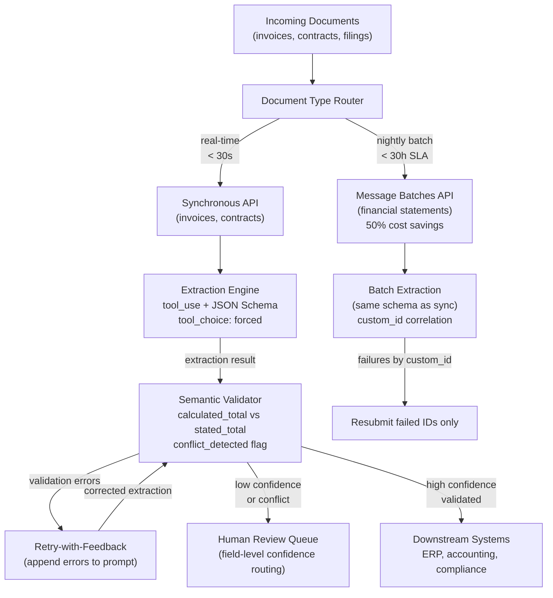

# Scenario 6: Structured Data Extraction

> **Primary domains:** 4 (Prompt Engineering & Structured Output), 5 (Context Management & Reliability)
> **Task statements in play:** 4.3, 4.2, 4.4, 4.5, 5.5, 5.6
> **Exam weight:** The most technically dense scenario for Domain 4. Every question involves a precise decision about schema design, validation logic, batch economics, or confidence calibration. Many distractors test whether you confuse syntax validation (what JSON schemas do) with semantic validation (what schemas don't do).

---

## Table of Contents
1. [The Scenario](#1-the-scenario)
2. [System Architecture](#2-system-architecture)
3. [Role of Each Domain in This Scenario](#3-role-of-each-domain-in-this-scenario)
4. [What This Scenario Tests From You](#4-what-this-scenario-tests-from-you)
5. [Domain Task-Statement Walkthrough](#5-domain-task-statement-walkthrough)
6. [Scenario-Specific Traps](#6-scenario-specific-traps)
7. [Practice Question Bank](#7-practice-question-bank)
8. [Answer Key](#8-answer-key)
9. [Quick-Recall Cheat Sheet](#9-quick-recall-cheat-sheet)

---

## 1. The Scenario

You are building a **structured data extraction system** for a legal and financial document processing company. The system processes:

| Document Type | Volume | Latency Requirement |
|---|---|---|
| Invoices (PDF, image) | 5,000/day | Real-time (< 30 seconds) |
| Contracts (PDF) | 200/day | Near real-time (< 5 minutes) |
| Financial statements (PDF, scanned) | 10,000/night | Overnight (< 30-hour SLA) |
| Regulatory filings (varied formats) | 500/week | Weekly batch |

**What the system extracts:**
- Invoice: vendor name, invoice number, line items, amounts, tax, total, payment terms
- Contract: parties, effective date, termination clauses, payment obligations, jurisdiction
- Financial statement: revenue, EBITDA, net income, debt, publication date, accounting standard

**Current problems being solved:**
1. Output format is inconsistent — sometimes JSON, sometimes prose, sometimes invalid JSON
2. Required fields are sometimes hallucinated when absent from the source document
3. Extraction fails on new document layouts (new vendor's invoice format)
4. Validation misses cases where totals don't match line items
5. High-volume nightly processing is expensive at full API rates
6. 97% overall accuracy hides poor performance on handwritten/scanned forms
7. Two financial sources report conflicting figures for the same company

**The central design challenge:** Extraction must be both structurally correct (valid JSON matching the schema) and semantically correct (values in the right fields, amounts that add up, conflicts surfaced rather than silently resolved). The exam constantly tests the boundary between what schemas guarantee and what they don't.

---

## 2. System Architecture



**Key facts to memorize:**
- `tool_use` + JSON schema = syntactic compliance guaranteed; semantic validation = code-level, post-extraction
- Nullable fields prevent hallucination of absent data
- Retry with specific validation errors = effective; retry when data is simply absent = ineffective
- Batch API: 50% savings, ≤24h window, no SLA — for latency-tolerant jobs only
- `custom_id` = the mechanism for correlating batch responses to requests

---

## 3. Role of Each Domain in This Scenario

| Domain | Role | Tested? |
|---|---|---|
| **Domain 1 — Agentic Architecture** | **Not tested.** No agentic loop or multi-agent orchestration in this scenario | No |
| **Domain 2 — Tool Design & MCP** | **Not tested.** No MCP servers or tool-design narrative | No |
| **Domain 3 — Claude Code Config** | **Not tested.** Not a Claude Code workflow | No |
| **Domain 4 — Prompt Engineering** | **Primary.** Owns schema design, few-shot extraction quality, validation/retry loops, and batch API economics | Yes — 4.3, 4.2, 4.4, 4.5 |
| **Domain 5 — Context & Reliability** | **Secondary.** Owns confidence calibration, stratified sampling for accuracy measurement, human-review routing, and multi-source conflict handling | Yes — 5.5, 5.6 |

**The short version:** Domain 4 is the primary lens — every major extraction design question belongs here. Domain 5 covers the downstream reliability concerns: how do you know if the extraction is accurate, when do you route to human review, and how do you handle conflicting source documents?

---

## 4. What This Scenario Tests From You

This scenario tests your **precision on structured output mechanics and quality measurement design**. The exam will ask you to distinguish between what a JSON schema guarantees vs. what it doesn't, when to retry vs. route to human review, how to calculate Batch API cost and timing, and how to build a review queue that isn't biased by aggregate metrics. The wrong answers in this scenario almost always confuse schema enforcement (syntactic) with semantic accuracy.

### Knowledge you must have cold

| Must know | Detail |
|---|---|
| `strict: true` scope | Guarantees **structural/syntactic** compliance only (correct keys, types, nesting) — does NOT prevent hallucinated field values |
| Nullable fields | `nullable: true` for optional fields tells the model to output `null` vs. fabricate — hallucination prevention |
| `tool_choice: {"type":"tool","name":"X"}` | Forces model to call the schema tool — required for guaranteed structured output |
| Batch API mechanics | Asynchronous; 50% cheaper; SLA = ≤24 hours; submit → poll for completion → retrieve |
| Retry decision | `isRetryable: true` = transient error → retry with backoff; `isRetryable: false` = logic error → route to human |
| Self-validating fields | `stated_total`, `calculated_total`, `conflict_detected` — computed at extraction time, not post-hoc |
| Confidence score limitation | Aggregate accuracy hides per-category variance; must analyze by category, vendor, and document type |
| Stratified sampling | Separate accuracy measurement per category — not all field types perform equally |
| "Lost in the middle" effect | Model misses information in the middle of very long inputs — move key facts to beginning/end |
| Few-shot for edge cases | Examples showing exactly how to handle `null` vs. absent field vs. ambiguous value |
| Human review routing | Low confidence extractions + category-level failures below SLA → human queue |

### Judgment calls the exam will ask you to make

| Exam question type | The judgment you must apply |
|---|---|
| "Schema enforced, but `vendor_name` shows competitor names — why?" | `strict: true` enforces structure, not value correctness — the model is still guessing values |
| "Optional `payment_terms` field is fabricated when absent — fix it" | Add `nullable: true` to the field schema |
| "Extraction accuracy is 94% overall but SLA is 96% — is that acceptable?" | No — stratify by category; individual categories may be far below 96% while average looks fine |
| "Document service times out intermittently — retry or route to human?" | Timeout = transient; `isRetryable: true` → retry with backoff |
| "500-line invoice causes the model to miss middle-section line items — fix it" | Reorder: place the middle section at the beginning; add section headers |
| "Batch job for end-of-day invoices must finish before 8 AM — is Batch API viable?" | 24h SLA is maximum — viable if submitted at end of prior day, not if submitted at 7 AM for 8 AM deadline |
| "Run nightly invoice extraction at reduced cost — which API?" | Batch API (50% cheaper, fits latency window) |

### Wrong-answer patterns to immediately recognize and reject

- Any answer claiming that **`strict: true` prevents the model from outputting wrong values** — schema enforces structure, not accuracy
- Any answer that **routes retry-able transient errors straight to human review** — adds unnecessary human cost for automatable recovery
- Any answer that **reports only aggregate accuracy** to assess SLA compliance — category-level variance is hidden
- Any answer that uses **Batch API for a time-sensitive blocking operation** — no latency guarantee
- Any answer that uses **`tool_choice: "auto"` for guaranteed structured extraction** — model can skip the tool call

---

## 5. Domain Task-Statement Walkthrough

### 4.3 — Structured Output via Tool Use and JSON Schema

**How it shows up here:**
Invoice extraction must produce machine-parseable JSON every time. Free-form text output cannot be reliably parsed for downstream ERP integration.

**The three-layer defense:**

**Layer 1 — Use `tool_use`, not prompt instructions:**
```json
{
  "tools": [{
    "name": "extract_invoice",
    "description": "Extract structured data from an invoice document",
    "input_schema": {
      "type": "object",
      "properties": {
        "vendor_name": { "type": "string" },
        "invoice_number": { "type": "string" },
        "invoice_date": { "type": "string", "description": "ISO 8601 format" },
        "line_items": {
          "type": "array",
          "items": {
            "type": "object",
            "properties": {
              "description": { "type": "string" },
              "quantity": { "type": "number" },
              "unit_price": { "type": "number" },
              "line_total": { "type": "number" }
            },
            "required": ["description", "quantity", "unit_price", "line_total"]
          }
        },
        "subtotal": { "type": "number" },
        "tax_amount": { "type": ["number", "null"] },
        "total_amount": { "type": "number" },
        "stated_total": { "type": "number" },
        "calculated_total": { "type": "number" },
        "conflict_detected": { "type": "boolean" },
        "payment_terms": { "type": ["string", "null"] },
        "extraction_confidence": { "type": "number", "minimum": 0, "maximum": 1 }
      },
      "required": ["vendor_name", "invoice_number", "invoice_date", "line_items",
                   "subtotal", "total_amount", "stated_total", "calculated_total",
                   "conflict_detected", "extraction_confidence"]
    }
  }],
  "tool_choice": { "type": "tool", "name": "extract_invoice" }
}
```

**Layer 2 — Nullable fields for absent data:**
| Field | Is it always present? | Schema type |
|---|---|---|
| `vendor_name` | Yes | `"string"` (required) |
| `payment_terms` | Sometimes | `["string", "null"]` (nullable) |
| `tax_amount` | Sometimes | `["number", "null"]` (nullable) |
| `po_number` | Rarely | `["string", "null"]` (nullable) |

**Layer 3 — Enum escape hatches:**
```json
"payment_terms_category": {
  "type": "string",
  "enum": ["net_30", "net_60", "immediate", "other", "unclear"],
  "description": "Use 'other' + payment_terms_detail for non-standard; 'unclear' if cannot determine"
}
```

**`tool_choice` decision table:**

| Situation | Setting | Effect |
|---|---|---|
| One schema, always required | `{"type": "tool", "name": "extract_invoice"}` | Model MUST call this exact tool |
| Multiple schemas; document type determines which | `"any"` | Model must call a tool; picks the right one |
| Optional extraction | `"auto"` | Model may call a tool OR return text |

**Right vs. wrong:**

| ✅ Correct | ❌ Wrong |
|---|---|
| `tool_use` with JSON schema | "Please respond in JSON format" — probabilistic, ~2-5% syntax errors |
| Nullable fields for absent data | All fields required — forces hallucination |
| `"other"` + detail field + `"unclear"` in enums | Closed enum without escape hatches — forces wrong category |
| `tool_choice: "any"` for multiple schemas | `tool_choice: "auto"` for structured extraction — model may return text |

---

### 4.2 — Few-Shot Prompting for Extraction Quality

**How it shows up here:**
Two extraction quality problems arise:
1. New vendor invoice formats break extraction — different field positions, different labels
2. Informal measurements ("about $5K", "~3 tons") cause hallucination of normalized values

**Few-shot examples for format diversity:**

```
Example 1 — Standard vendor format:
Input: [standard invoice with labeled fields]
Output: { vendor_name: "Acme Corp", invoice_number: "INV-2024-001", ... }

Example 2 — Minimal format (no explicit labels):
Input: [invoice where amounts appear in a table without headers]
Output: { vendor_name: "Extracted from bottom signature block: TechSupply Ltd", 
          invoice_number: "Found in upper-right corner: #4421", ... }

Example 3 — Scanned form with handwriting:
Input: [scanned invoice with handwritten amounts]
Output: { vendor_name: "Best effort from handwriting: 'Smith & Co'",
          extraction_confidence: 0.72, ... }
```

**Few-shot examples for informal measurements:**

```
Example — "approximately $5,000":
Wrong: { amount: 5000 }  ← hallucinated precision
Correct: { amount: null, amount_note: "Invoice states 'approximately $5,000'" }

Example — "~3 metric tons":
Wrong: { weight_kg: 3000 }  ← hallucinated unit conversion
Correct: { weight: null, weight_note: "~3 metric tons — exact figure unclear" }
```

**Right vs. wrong:**

| ✅ Correct | ❌ Wrong |
|---|---|
| 2-3 few-shot examples covering distinct document layouts (standard, minimal, handwritten) | Use only one example of the most common layout — breaks on new formats |
| Examples showing correct handling of informal measurements (null + note) | Rely on prompt instructions alone to handle measurement ambiguity |
| Examples for ambiguous cases that show the reasoning, not just the output | Examples that only show input/output without explaining why |

---

### 4.4 — Validation, Retry, and Feedback Loops

**How it shows up here:**
Three validation scenarios arise on this system:

**Scenario A — Semantic validation (what `strict: true` does NOT catch):**
```
Invoice line items:
  Item A: $100 × 3 = $300
  Item B: $50 × 2 = $100
  Total on invoice: $450  ← stated in the document

Claude's extraction:
  line_items: [...sum to $400]
  stated_total: $450
  calculated_total: $400
  conflict_detected: true   ← self-validating field catches this
```

**Scenario B — Retry with specific error feedback (effective):**
```
Validation error:
  "calculated_total ($400) does not equal sum of line items ($400).
   Re-examine line items — the $50 item may have a quantity of 3, not 2."

Retry prompt:
  [Original document] + [Failed extraction] + [Specific errors above]
  → Model corrects the quantity field
```

**Scenario C — Retry with missing information (NOT effective):**
```
Error: "payment_terms is null but should have a value"
  ↓
Retry with this error
  ↓
Result: Same null — because payment terms are genuinely absent from the document
  ↓
Correct action: Route to human review — retry won't help
```

**Right vs. wrong:**

| ✅ Correct | ❌ Wrong |
|---|---|
| Self-validating fields: `calculated_total` alongside `stated_total`, `conflict_detected` boolean | Assume `strict: true` catches semantic errors — it only guarantees JSON syntax |
| Retry with specific validation errors appended to the prompt (include the failed extraction) | Retry by simply re-submitting the same prompt without error feedback |
| Before retrying, check: Is the required information actually in the source document? | Retry indefinitely for any validation failure |
| Route to human review when data is genuinely absent from the source | Keep retrying for absent data — retries are ineffective when the data doesn't exist |

---

### 4.5 — Batch Processing Strategy

**How it shows up here:**
The nightly financial statement processing (10,000 documents) is expensive at full synchronous API rates. The 30-hour SLA allows significant batch processing flexibility.

**Batch API facts (memorize precisely):**
- Cost savings: **50%** compared to synchronous API
- Maximum processing window: **up to 24 hours** per batch
- Latency SLA: **none** — the 24-hour window is not guaranteed
- Multi-turn tool calling: **not supported** within a single batch request
- Correlation mechanism: `custom_id` field on each request

**SLA math:**
```
SLA: 30-hour total processing time
Batch window: up to 24 hours (no guarantee of exactly 24h)
Safety buffer needed: 30h - 24h = 6 hours

Maximum submission frequency: every 6 hours
  → If documents arrive at hour 0 and SLA expires at hour 30,
    submit batch by hour 6 to guarantee delivery within the SLA
```

**Handling batch failures:**
```
Batch run results:
  custom_id: "stmt_001" → success
  custom_id: "stmt_002" → error: context_limit_exceeded
  custom_id: "stmt_003" → success
  ...

Correct approach:
  Resubmit only custom_id "stmt_002" with modifications (chunk the document)
  → Do NOT resubmit the entire batch — wastes cost and duplicates successful extractions
```

**Right vs. wrong:**

| ✅ Correct | ❌ Wrong |
|---|---|
| Batch API for nightly financial statements (latency-tolerant) | Batch API for real-time invoice processing — no latency guarantee |
| Synchronous API for real-time invoices (< 30s requirement) | Batch API for blocking pre-merge CI checks |
| Resubmit only failed `custom_id` entries with modifications | Resubmit the entire batch when any document fails |
| Test and refine prompts on a sample set before batch-processing all 10,000 | Submit all 10,000 and refine after seeing failures — wastes a full batch cycle |
| Calculate submission frequency based on SLA window minus batch window | Submit whenever convenient — may miss SLA |

---

### 5.5 — Human Review Workflows and Confidence Calibration

**How it shows up here:**
The system's 97% overall accuracy sounds impressive, but hides a critical problem: handwritten/scanned forms have a 60% error rate. The aggregate metric masks poor performance on a specific document type.

**The stratified sampling requirement:**
```
Overall accuracy = 97%  ← aggregate, misleading

Breakdown by document type:
  PDF (digital):  99.8% accuracy ← excellent
  Scanned printed: 98.1% accuracy ← very good
  Handwritten forms: 40% accuracy ← catastrophic hidden failure

Without stratified analysis: the system appears to qualify for automation
With stratified analysis: handwritten forms must be routed to human review
```

**Field-level confidence calibration:**
```json
{
  "vendor_name": { "value": "TechSupply Ltd", "confidence": 0.99 },
  "invoice_date": { "value": "2024-01-15", "confidence": 0.85 },
  "total_amount": { "value": 4750.00, "confidence": 0.92 },
  "payment_terms": { "value": null, "confidence": null },
  "handwritten_region_detected": true
}
```

**Calibration process:**
1. Collect labeled validation set (1,000 extractions with known-correct answers)
2. For each confidence threshold (0.7, 0.8, 0.9, 0.95), measure actual accuracy
3. Set review routing threshold where model confidence reliably predicts extraction accuracy
4. Stratified random sampling of high-confidence pool (5% from each confidence stratum) for ongoing monitoring

**Right vs. wrong:**

| ✅ Correct | ❌ Wrong |
|---|---|
| Analyze accuracy by document type and field segment before reducing human review | Use 97% aggregate accuracy to justify removing human review across all document types |
| Stratified random sampling of high-confidence extractions (5% sample across strata) | Random sampling without stratification — rare failure patterns underrepresented |
| Calibrate field-level confidence thresholds against a labeled validation set | Use raw model confidence scores as-is without calibration against actual accuracy |
| Route low-confidence or `conflict_detected: true` extractions to human review | Route based on document length or processing time — not correlated with accuracy |

---

### 5.6 — Information Provenance and Conflict Handling

**How it shows up here:**
Financial statement processing across multiple sources produces two conflict scenarios:

**Conflict A — Same company, different figures:**
```
Source A (Bloomberg, GAAP): TechCorp Q3 revenue = $4.2B
Source B (Reuters, non-GAAP): TechCorp Q3 revenue = $3.9B

Wrong approach: Pick the more recent source ($3.9B from Reuters)
Wrong approach: Average the two ($4.05B — a figure neither source reported)
Correct approach: 
{
  "revenue_gaap": 4.2,
  "revenue_non_gaap": 3.9,
  "conflict_detected": true,
  "source_a": { "value": 4.2, "source": "Bloomberg", "date": "2024-10-15", "standard": "GAAP" },
  "source_b": { "value": 3.9, "source": "Reuters", "date": "2024-10-16", "standard": "non-GAAP" }
}
```

**Conflict B — Temporal difference misread as contradiction:**
```
Document A (2020 annual report): Revenue = $3.1B
Document B (2024 annual report): Revenue = $6.8B

Without dates: appears contradictory
With dates: correctly interpreted as growth over 4 years

Correct fix: Require publication_date in every extraction output
```

**Right vs. wrong:**

| ✅ Correct | ❌ Wrong |
|---|---|
| Annotate conflict: both values + source attribution + methodology | Pick one value, drop the other |
| Require `publication_date` in every structured output to enable temporal interpretation | Omit dates — reader cannot tell if figures are from different time periods |
| Complete document extraction with conflicting values annotated; let coordinator/human decide | Resolve conflict before returning extraction — hides the disagreement |
| Render financial data as tables, news as prose, technical findings as structured lists | Convert everything to a uniform prose format — appropriate rendering carries meaning |

---

## 6. Scenario-Specific Traps

| Trap | Why it's wrong | Correct approach |
|---|---|---|
| "Please respond in JSON format" in the prompt | Probabilistic — ~2-5% of responses include preamble/suffix that breaks parsing | `tool_use` + JSON schema with forced `tool_choice` |
| Making all fields required in the schema | Forces hallucination when data is absent (e.g., payment terms not present in some invoices) | Nullable fields for data that may be absent |
| Removing `strict: true` when totals don't match | `strict: true` only validates syntax — it cannot catch semantic errors like wrong totals | Keep `strict: true`; add `calculated_total` + `stated_total` + `conflict_detected` self-validating fields |
| Retrying when the required data is absent from the source | Retries are ineffective if the data simply doesn't exist in the document | Check whether data is absent; if so, route to human review |
| Using the Batch API for real-time invoice processing | Batch API has no latency guarantee (up to 24h) — real-time invoices need sub-30-second response | Synchronous API for real-time; Batch API only for latency-tolerant nightly jobs |
| Resubmitting the entire batch when a few documents fail | All successful extractions are re-processed, doubling cost for those documents | Resubmit only failed `custom_id` entries with appropriate modifications |
| Using 97% aggregate accuracy to justify removing human review | Aggregate masks poor segment performance — handwritten forms may have 40% accuracy | Stratify accuracy by document type and field segment before automating |
| Silently picking one value when sources conflict | Destroys information fidelity; report presents false precision | Annotate conflict with both values, both sources, and methodological context |

---

## 7. Practice Question Bank

> **Instructions:** All questions are anchored to Scenario 6. Read each in the context of the structured data extraction system for legal and financial documents described above.

---

### 4.3 — Structured Output (4 questions)

**Q1.** Invoice extraction outputs are reliable 97% of the time, but 3% of extractions fail because Claude returns text like "Here is the extracted data:" followed by JSON. Downstream ERP parsing fails on these. The correct fix is:

- A) Add a post-processing step to strip any text prefix before the JSON
- B) Add "IMPORTANT: Output ONLY valid JSON with no surrounding text" to the system prompt
- C) Use `tool_use` with a JSON schema and `tool_choice: {"type": "tool", "name": "extract_invoice"}` — this eliminates the text preamble by design
- D) Increase the model's temperature to reduce inconsistent formatting behavior

---

**Q2.** A contract extraction schema has `governing_jurisdiction` marked as required. For international contracts, this field is sometimes embedded in a cross-reference to an attachment not included in the extraction. Claude consistently invents values like "New York" or "Delaware" for these contracts. What is the correct schema fix?

- A) Add more examples of jurisdiction formats to the schema description
- B) Change `governing_jurisdiction` to nullable: `"type": ["string", "null"]` — Claude can return null when the value is genuinely absent, preventing fabrication
- C) Add a post-processing step that validates jurisdiction values against a known list
- D) Add a prompt instruction: "If governing_jurisdiction is not present, write 'unknown'"

---

**Q3.** The financial statement extraction schema includes a field `accounting_standard` that should be one of: GAAP, IFRS, local GAAP, or other. A new filing uses a regional standard not in the list. With a closed enum `["GAAP", "IFRS", "local_GAAP"]`, what will Claude do?

- A) Return null for the field since the value doesn't match any option
- B) Return an error indicating the filing uses an unrecognized standard
- C) Force the value into one of the three options — likely "local_GAAP" — even if it's wrong
- D) Refuse to extract the filing and request human review

---

**Q4.** The extraction system processes both invoice PDFs and scanned financial statements. Each document type requires a different extraction schema. The document type is determined after reading the document. Which `tool_choice` setting enables the model to select the appropriate extraction schema?

- A) `tool_choice: "auto"` — the model selects the right schema when needed
- B) `tool_choice: {"type": "tool", "name": "extract_invoice"}` — always use the invoice schema
- C) `tool_choice: "any"` — the model must call a tool and can choose between the invoice schema and the financial statement schema based on the document type
- D) No `tool_choice` setting — define both schemas and trust the model to call the right one

---

### 4.2 — Few-Shot Prompting (3 questions)

**Q5.** Invoice extraction works well for standard printed invoices but fails on a new vendor whose invoices have no labeled fields — amounts appear in a table without headers, and the vendor name appears only in a footer signature block. The most effective fix is:

- A) Add the new vendor's invoice format to a vendor-specific preprocessing pipeline
- B) Add a few-shot example showing correct extraction from a minimal-format invoice (no labeled fields, data in tables, vendor name in footer) — the model learns to locate fields by position and context
- C) Train a custom extraction model on this vendor's specific format
- D) Request that the vendor update their invoice template to standard format

---

**Q6.** An invoice states: "Total due: approximately $12,500." The extraction model returns `{ "total_amount": 12500 }`. This is wrong because:

- A) The model should have used a different currency format
- B) The model fabricated a precise figure from an approximate value — the extraction implies a certainty that doesn't exist in the source document. The correct output preserves the approximation: `{ "total_amount": null, "total_amount_note": "stated as 'approximately $12,500'" }`
- C) The model should have returned an error since the total is not exact
- D) The extraction is correct — $12,500 is the most reasonable interpretation of "approximately $12,500"

---

**Q7.** Few-shot examples are most effective for which type of extraction problem?

- A) Handling documents that exceed the context window
- B) Improving structural output compliance (ensuring valid JSON)
- C) Demonstrating correct handling of varied document layouts and ambiguous values so the model generalizes judgment to novel documents
- D) Reducing the number of API calls needed per extraction

---

### 4.4 — Validation, Retry, and Feedback (4 questions)

**Q8.** An invoice extraction passes schema validation (`strict: true`) but the sum of extracted line items ($1,200) doesn't equal the stated total ($1,350). `strict: true` did not catch this. This is because:

- A) The schema was incorrectly configured — `strict: true` should have caught this arithmetic error
- B) `strict: true` guarantees JSON syntax compliance only — it cannot validate that numbers add up correctly. Semantic validation requires code-level checks after extraction.
- C) The total field was not marked as required in the schema
- D) `strict: true` only works for string fields — it doesn't validate numeric relationships

---

**Q9.** An extraction fails validation with the error: "calculated_total ($1,200) does not match stated_total ($1,350). Discrepancy of $150 detected." The correct retry approach is:

- A) Re-submit the same prompt without changes — sometimes the model produces a different result on retry
- B) Re-submit with only the original document
- C) Append the specific validation errors to the retry prompt: include the original document, the failed extraction, and the specific discrepancy ("The $150 difference may indicate a missed line item or an error in the quantity field for one of the items")
- D) Immediately route to human review without retrying

---

**Q10.** After 3 retries, the `payment_terms` field continues to extract as null. The validation error is: "payment_terms should not be null for this document type." What is the correct diagnosis and action?

- A) Increase the maximum retry count — the model will eventually find the payment terms
- B) Improve the prompt instructions for extracting payment terms
- C) Check whether payment terms actually appear in the source document. If absent from the document, retries will not help — mark as absent and route to human review. Retries are only effective for format errors, not for genuinely absent data.
- D) Switch to a more capable model that can infer payment terms from context

---

**Q11.** You want to detect when an invoice's arithmetic is internally inconsistent (line items don't sum to subtotal) at the extraction level, rather than in a separate validation step. The correct approach is:

- A) Add a prompt instruction: "Verify all arithmetic before outputting"
- B) Add both `stated_total` and `calculated_total` fields to the schema, along with a `conflict_detected` boolean — Claude extracts what the document states AND computes the sum of line items, surfacing any discrepancy as a structured field
- C) Use `strict: true` with a numeric validation constraint
- D) Post-process the extraction by summing line items in code and comparing to the total

---

### 4.5 — Batch Processing (3 questions)

**Q12.** 10,000 financial statements need to be processed nightly with a 30-hour SLA. Each statement takes about 3 seconds of API time. Which API approach is correct?

- A) Synchronous API — process all 10,000 sequentially in real time
- B) Message Batches API — latency-tolerant overnight processing at 50% cost savings; submit by hour 6 to guarantee delivery within the 30-hour SLA
- C) Message Batches API — submit all 10,000 at once and expect results within 24 hours
- D) Synchronous API — Batch API doesn't support multi-field extraction schemas

---

**Q13.** A nightly batch of 10,000 financial statements completes with 9,850 successes and 150 failures. The failures all have `error: "context_limit_exceeded"`. What is the correct remediation?

- A) Resubmit the entire batch of 10,000 with a shorter prompt
- B) Resubmit only the 150 failed `custom_id` entries, with each statement chunked into smaller sections to fit within the context limit
- C) Mark the 150 as permanently failed and route to a manual processing queue
- D) Switch to synchronous API for the 150 failed documents

---

**Q14.** A product manager requests that the pre-commit code quality check (which must complete before merging a PR) use the Batch API to save costs. Why is this wrong?

- A) The Batch API is more expensive than the synchronous API for small batches
- B) The Batch API has a processing window of up to 24 hours with no guaranteed latency SLA — a pre-merge blocking check that could take 24 hours is not acceptable for a CI/CD workflow
- C) The Batch API doesn't support the structured output format needed for code review
- D) The Batch API requires a minimum of 1,000 requests per batch, which is impractical for individual PRs

---

### 5.5 — Human Review and Confidence Calibration (3 questions)

**Q15.** The extraction system reports 97% overall accuracy across all document types. Based on this metric, the team decides to remove human review for all "high confidence" extractions. Why is this premature?

- A) 97% accuracy means 3% error rate — human review capacity may still be needed at scale
- B) The 97% aggregate may mask dramatically different accuracy rates by document type — handwritten forms might have 40% accuracy while digital PDFs have 99.8%. Stratified analysis by document type and field must confirm consistent performance before removing review.
- C) Human review should never be removed from financial document processing due to regulatory requirements
- D) 97% accuracy requires validation on a larger sample before being considered reliable

---

**Q16.** The extraction system outputs `extraction_confidence: 0.91` for a financial statement. Before trusting this confidence score to route review decisions, what is required?

- A) A confidence score above 0.9 is universally accepted as high enough for automation
- B) The confidence score must be calibrated against a labeled validation set — compare model confidence to actual accuracy for 1,000 extractions to determine what confidence threshold reliably predicts correct extraction
- C) The confidence score should be averaged with the document's page count for a combined reliability metric
- D) Confidence scores are standardized across all Claude models — no calibration is needed

---

**Q17.** Which of the following best describes stratified random sampling for monitoring extraction quality?

- A) Randomly selecting 5% of all extractions regardless of confidence level for human review
- B) Selecting a proportional sample from each confidence stratum (e.g., 5% from high-confidence, 5% from medium-confidence, 5% from low-confidence extractions) to measure actual accuracy per stratum and detect novel failure patterns in underrepresented categories
- C) Selecting the 5% of extractions with the lowest confidence scores for human review
- D) Selecting 5% of extractions from each document type for review

---

### 5.6 — Provenance and Conflict Handling (3 questions)

**Q18.** Bloomberg reports TechCorp's Q3 2024 revenue as $4.2B (GAAP) and Reuters reports it as $3.9B (non-GAAP adjusted). The extraction system should:

- A) Use the Bloomberg figure since Bloomberg is the more authoritative financial source
- B) Use the Reuters figure since it was published more recently
- C) Calculate the average ($4.05B) and use that as the extracted value
- D) Annotate both figures in the output with source attribution, publication dates, and accounting methodology; set `conflict_detected: true`; let the downstream system or human reviewer reconcile

---

**Q19.** Two financial statements are extracted: a 2020 annual report showing $3.1B revenue and a 2024 annual report showing $6.8B revenue. The validation system flags these as "conflicting revenue figures." How do you fix this false alarm?

- A) Remove the conflict detection logic since revenue naturally changes over time
- B) Accept the false alarm as acceptable noise in the system
- C) Require `publication_date` in every extraction output — the conflict detection logic can then correctly identify these as temporal data points (2020 vs 2024 revenue) rather than contradictions
- D) Add a special case rule: "Revenue figures from different years cannot conflict"

---

**Q20.** A synthesis layer combines extracted financial data from multiple documents to produce a company financial summary. The summary should present revenue figures from two sources that use different accounting standards. The correct presentation is:

- A) Convert all figures to GAAP before summarizing to ensure consistency
- B) Use the most recent figure only
- C) Present both figures in a table with columns for source, date, accounting standard, and value — financial data rendered as a structured table preserves the distinct contexts of each figure
- D) Present both figures in prose: "Revenue ranged from $3.9B to $4.2B"

---

## 8. Answer Key

**Q1: C**
`tool_use` with a forced `tool_choice` prevents text preamble by design — the model calls the extraction tool and the result is a structured tool call, not a text response that could include surrounding text. Post-processing (A) is fragile. Prompt instructions (B) are probabilistic — this is the exact failure they're experiencing. Temperature affects randomness, not formatting (D).

**Q2: B**
Nullable fields (`"type": ["string", "null"]`) are the correct solution for fields that may legitimately be absent from source documents. This allows Claude to return null rather than fabricating a value. Adding examples (A) and post-processing (C) don't address the schema-level issue. A prompt instruction "write 'unknown'" (D) returns a string — better would be null with a note, but the most principled fix is nullable typing.

**Q3: C**
With a closed enum, the model is constrained to pick one of the defined values — it cannot return null or a different value. It will force the closest match, which may be incorrect. The correct fix is to add `"other"` and `"unclear"` to the enum as escape hatches.

**Q4: C**
`tool_choice: "any"` forces the model to call one of the available tools but lets it choose which — the correct setting when the document type determines which schema applies. `"auto"` (A) allows text responses. Forcing a specific tool (B) ignores financial statement documents. No tool_choice (D) allows text responses.

**Q5: B**
Few-shot examples showing extraction from minimal-format invoices (no labeled fields, positional data) teach the model to locate information by context and position rather than by label. This generalizes to other non-standard formats. Vendor-specific preprocessing (A) doesn't scale. Custom model training (C) is expensive and slow.

**Q6: B**
Extracting 12,500 from "approximately $12,500" fabricates precision that doesn't exist in the source. The model is creating a specific figure from a vague statement. The correct extraction preserves the approximation nature of the value, either as null with a note or with an explicit uncertainty flag.

**Q7: C**
Few-shot examples teach the model to handle varied document layouts and ambiguous values by demonstrating the reasoning behind correct extraction decisions. The model generalizes this reasoning to novel cases. Schema compliance (B) is handled by `tool_use`, not few-shot. Context window handling (A) and API call reduction (D) are not addressed by few-shot examples.

**Q8: B**
`strict: true` validates that the JSON structure matches the schema — required fields are present, types are correct, enum values are valid. It cannot perform semantic checks like "do these numbers add up." This is a fundamental distinction: structural validity vs. semantic correctness.

**Q9: C**
Retry with specific validation errors provides the model with targeted guidance for self-correction. The errors explain what went wrong and suggest where to look. Retrying without changes (A, B) gives the model no new information. Immediate escalation (D) is premature — the error is likely recoverable with feedback.

**Q10: C**
Retries are only effective for format errors or misextraction — not for data that is genuinely absent from the source document. Before retrying, the correct diagnosis is to check whether the information exists in the document at all. If it doesn't exist, any number of retries will return the same null result.

**Q11: B**
Self-validating fields (`calculated_total` alongside `stated_total`, `conflict_detected` boolean) embed the validation logic directly in the extraction schema. The model computes both values and flags any discrepancy as a structured field — detectable programmatically without an external validation step. Prompt arithmetic instructions (A) are probabilistic. `strict: true` (C) doesn't do arithmetic. Post-processing (D) works but doesn't surface the conflict in the extraction output itself.

**Q12: B**
10,000 documents at 3 seconds each = 8.3 hours of sequential processing. The Batch API provides 50% cost savings and handles this volume overnight. The SLA math: 30h SLA − 24h batch window = 6h buffer, so submit by hour 6. Option C is wrong because the 24-hour window is a maximum, not a guarantee. The Batch API supports multi-field schemas (D is wrong).

**Q13: B**
`custom_id` is the mechanism for identifying specific failed requests. Resubmitting only the 150 failed documents with chunked content avoids re-processing 9,850 successful extractions. Resubmitting everything (A) duplicates successful work. Permanent failure (C) may be premature. Synchronous API (D) works but doesn't address the chunking needed to fix the context error.

**Q14: B**
The Batch API's 24-hour processing window with no SLA guarantee makes it fundamentally incompatible with blocking CI checks. A PR review that might take 24 hours before a developer can merge is not a usable workflow. This is the clearest "wrong API for the use case" trap in the exam.

**Q15: B**
Aggregate accuracy metrics hide segment-level performance. A 97% aggregate with a 40% error rate on handwritten forms would be catastrophically misleading — those forms would pass the automation threshold incorrectly. Stratified analysis by document type and field is required before reducing human review.

**Q16: B**
Raw model confidence scores are not calibrated to actual accuracy without a labeled validation set. A confidence of 0.91 might correspond to 95% accuracy in practice, or it might correspond to 75% accuracy — without calibration, the score is meaningless for routing decisions.

**Q17: B**
Stratified sampling samples proportionally from each confidence stratum — not just from the low-confidence pool (C) or uniformly (A). This ensures that rare failure patterns in the high-confidence stratum are detected even though they appear infrequently. Sampling by document type (D) is a different dimension.

**Q18: D**
Both figures are correct in their respective accounting contexts. The extraction system's job is not to resolve the conflict but to preserve both values with full provenance for downstream reconciliation. Any choice (A, B, C) that picks one value or creates a new one destroys the fidelity of the source data.

**Q19: C**
Requiring `publication_date` in every extraction output gives the conflict detection logic the temporal context it needs to distinguish "same metric, different time periods" from "same metric, same time period, different values." Without dates, the system can't tell whether a revenue discrepancy is temporal growth or a real conflict.

**Q20: C**
Financial data presented as a table preserves the distinct context of each figure (source, date, standard) in a format optimized for comparison. Prose (D) loses the structural relationship between the figures. Converting to GAAP (A) requires transformation that may not be possible without additional context. Using only the most recent figure (B) drops valid information.

---

## 9. Quick-Recall Cheat Sheet

**Structured output (4.3)**
- `tool_use` + JSON schema = syntactic compliance guaranteed
- `tool_choice: {"type":"tool","name":"X"}` = must call X specifically
- `tool_choice: "any"` = must call a tool; picks from multiple schemas
- `tool_choice: "auto"` = may skip tools — never for guaranteed extraction
- Nullable fields (`["string", "null"]`) = prevent hallucination for absent data
- Enum escape hatches: always add `"other"` + detail field + `"unclear"`

**`strict: true` boundary (CRITICAL)**
- `strict: true` = JSON syntax valid + required fields present + types correct
- `strict: true` CANNOT: verify arithmetic, catch wrong-field values, detect semantic conflicts
- Semantic validation = code-level, after extraction: sum line items, compare totals, flag conflicts

**Self-validating fields**
- `stated_total` = what the document says
- `calculated_total` = sum of extracted line items
- `conflict_detected` = boolean flag for discrepancy
- These make semantic errors visible as structured data

**Few-shot (4.2)**
- New formats → few-shot examples covering diverse layouts (standard, minimal, handwritten)
- Informal measurements → examples showing null + note (not fabricated precision)
- 2-3 diverse examples > 1 perfect example of the most common case

**Validation/retry (4.4)**
- Retry WITH specific errors → effective for format mismatches
- Retry WITHOUT new info → useless
- Data absent from document → retry NEVER helps → human review
- Pre-retry check: does the required information actually exist in the source?

**Batch API (4.5)**
- 50% cost savings; ≤24h window; NO latency SLA
- Real-time invoices → Synchronous API
- Nightly batch, weekly audit → Batch API
- SLA math: SLA − 24h batch window = buffer; submit by (SLA − 24h)
- Failed items: resubmit only failed `custom_id` entries with modifications

**Confidence calibration (5.5)**
- Raw confidence ≠ accuracy; must calibrate against labeled validation set
- 97% aggregate ≠ safe for automation; stratify by document type and field
- Stratified sampling: 5% from each confidence stratum, not just low-confidence
- Route: low confidence OR conflict_detected → human review

**Conflict handling (5.6)**
- Two sources disagree → annotate both with source, date, methodology
- `conflict_detected: true` + both values = correct; picking one = wrong
- Require `publication_date` in every output to distinguish temporal vs. real conflicts
- Render financial data as tables, not uniform prose
